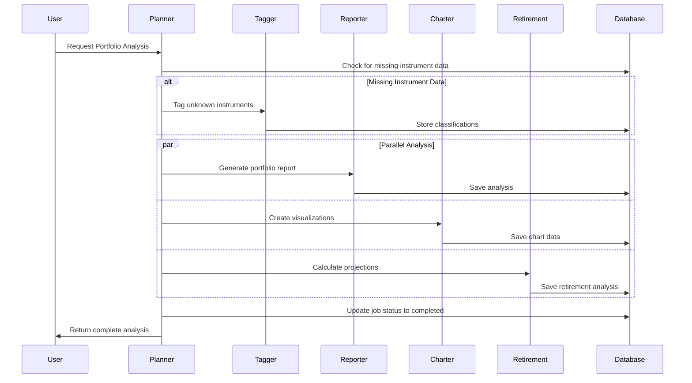

# Alex - Agentic Learning Equities eXplainer

## Executive Summary

**Alex** is a production-grade, multi-agent AI financial planning platform that analyzes investment portfolios, generates personalized retirement projections, and provides actionable financial advice. Built entirely on AWS serverless infrastructure, Alex demonstrates enterprise-level AI agent orchestration, cost-optimized vector search, and modern full-stack development practices.

**Project Type:** Educational Capstone Project (Weeks 3-4, "AI in Production" Course by Ed Donner)
**Target Users:** Retail investors seeking comprehensive portfolio analysis and retirement planning
**Technology Stack:** AWS Serverless, OpenAI Agents SDK, Next.js, Python 3.12, Terraform
**Key Innovation:** 90% cost reduction in vector storage using S3 Vectors instead of traditional vector databases

---

## Table of Contents
1. [What Alex Does](#what-alex-does)
2. [System Architecture](#system-architecture)
3. [AI Agent Collaboration](#ai-agent-collaboration)
4. [Technical Infrastructure](#technical-infrastructure)
5. [Data Model](#data-model)
6. [User Experience Flow](#user-experience-flow)
7. [Deployment Architecture](#deployment-architecture)
8. [Cost Analysis](#cost-analysis)
9. [Security & Authentication](#security--authentication)
10. [Testing Strategy](#testing-strategy)
11. [Key Design Decisions](#key-design-decisions)
12. [Development Workflow](#development-workflow)

---

## What Alex Does

### Core Features

#### 1. **Portfolio Analysis**
- Analyzes user investment portfolios across multiple accounts (401k, IRA, Taxable)
- Evaluates asset allocation, geographic diversification, and sector exposure
- Identifies concentration risks and imbalances
- Generates comprehensive written reports with actionable recommendations

#### 2. **Visual Insights**
- Creates 4-6 interactive charts showing portfolio composition
- Visualizations include:
  - Asset class distribution (equity, fixed income, alternatives)
  - Geographic exposure (North America, Europe, Asia, etc.)
  - Sector allocation (Technology, Healthcare, Financials, etc.)
  - Account type distribution
  - Top holdings concentration

#### 3. **Retirement Projections**
- Projects portfolio value at retirement based on historical market assumptions
- Runs Monte Carlo simulations (1000 scenarios) for probability analysis
- Calculates expected annual retirement income
- Analyzes portfolio sustainability over 30-year retirement period
- Identifies gaps between current trajectory and retirement goals

#### 4. **Market Research** (Autonomous)
- Independent research agent runs every 2 hours via EventBridge scheduler
- Browses financial websites for latest market trends and news
- Analyzes company earnings reports and economic indicators
- Stores insights in S3 Vectors knowledge base for future portfolio analyses
- Provides up-to-date context for investment recommendations

#### 5. **Instrument Classification**
- Automatically classifies stocks and ETFs when first encountered
- Determines asset class, regional allocation, and sector exposure
- Stores reference data for fast portfolio calculations
- Future: Integration with Polygon API for real-time market data

---

## System Architecture

### High-Level Architecture

```
User Request → NextJS Frontend (CloudFront + S3)
              ↓
         FastAPI Backend (API Gateway + Lambda)
              ↓
         SQS Queue (Job Orchestration)
              ↓
         Planner Agent (Orchestrator Lambda)
              ↓
    ┌─────────┴─────────┬─────────────┬──────────────┐
    ↓                   ↓             ↓              ↓
Tagger Agent    Reporter Agent  Charter Agent  Retirement Agent
    ↓                   ↓             ↓              ↓
    └──────────────┬────┴─────────────┴──────────────┘
                   ↓
           Aurora Database (Results Storage)
                   ↓
           Frontend Display
```

### AWS Services Used

| Service | Purpose | Cost Model |
|---------|---------|------------|
| **Lambda** | Agent execution, API backend, ingestion | Pay per invocation |
| **Aurora Serverless v2** | User data, portfolios, analysis results | ACU-based (0.5-1 ACU) |
| **S3 Vectors** | Vector storage for market research | Storage + query |
| **SageMaker Serverless** | Text embeddings (all-MiniLM-L6-v2) | Pay per request |
| **AWS Bedrock** | LLM inference (Nova Pro model) | Pay per token |
| **App Runner** | Researcher agent container service | vCPU + memory hours |
| **CloudFront** | Frontend CDN | Data transfer |
| **API Gateway** | REST API for frontend/backend | Requests + data |
| **SQS** | Job queue for agent orchestration | Free tier sufficient |
| **EventBridge** | Scheduled research triggers (every 2hrs) | Free tier sufficient |
| **CloudWatch** | Logging, monitoring, dashboards | Logs + metrics |
| **Secrets Manager** | Database credentials | Per secret |

---

## AI Agent Collaboration

### Agent Architecture Pattern

Alex uses a **orchestrator-specialist pattern** where a central Planner agent coordinates multiple specialized agents:

```
Financial Planner (Orchestrator)
├── InstrumentTagger: Classifies unknown instruments
├── Report Writer: Generates analysis narratives
├── Chart Maker: Creates visualization data
└── Retirement Specialist: Projects future scenarios
```

### Agent Collaboration Flow



### The 6 AI Agents

#### 1. **Financial Planner (Orchestrator)**
- **Model:** AWS Bedrock Nova Pro
- **Runtime:** AWS Lambda
- **Responsibilities:**
  - Receives analysis requests from SQS queue
  - Identifies missing instrument data
  - Coordinates specialist agents (Tagger, Reporter, Charter, Retirement)
  - Retrieves market research from S3 Vectors for context
  - Compiles final results and updates job status
  - Handles error states and retries
- **Execution Time:** 2-3 minutes for full portfolio analysis
- **Key Pattern:** Uses OpenAI Agents SDK for orchestration with tool calling

#### 2. **InstrumentTagger**
- **Model:** AWS Bedrock Nova Pro
- **Runtime:** AWS Lambda
- **Responsibilities:**
  - Classifies ETFs and stocks by asset class, region, sector
  - Determines current market price
  - Stores reference data in Aurora database
  - Ensures allocation percentages sum to 100%
- **Execution Time:** 5-10 seconds per instrument
- **Key Pattern:** Uses Structured Outputs for consistent data format (NOT tool calling - can't use both)

#### 3. **Report Writer**
- **Model:** AWS Bedrock Nova Pro
- **Runtime:** AWS Lambda
- **Responsibilities:**
  - Analyzes portfolio composition and diversification
  - Evaluates risk exposure
  - Retrieves market insights from S3 Vectors via tool
  - Generates comprehensive markdown reports
  - Provides 5-7 actionable recommendations
- **Execution Time:** 20-30 seconds
- **Key Pattern:** Uses tool calling to fetch market context (NOT Structured Outputs)

#### 4. **Chart Maker**
- **Model:** AWS Bedrock Nova Pro
- **Runtime:** AWS Lambda
- **Responsibilities:**
  - Calculates allocation percentages across dimensions
  - Creates 4-6 visualization charts (pie, bar, donut)
  - Formats data for Recharts library in frontend
  - Ensures accurate dollar amounts (not percentages)
- **Execution Time:** 10-15 seconds
- **Key Pattern:** Uses Structured Outputs for JSON chart schema

#### 5. **Retirement Specialist**
- **Model:** AWS Bedrock Nova Pro
- **Runtime:** AWS Lambda
- **Responsibilities:**
  - Projects portfolio value at retirement
  - Runs Monte Carlo simulations (1000 scenarios)
  - Calculates safe withdrawal rates
  - Analyzes retirement readiness and gaps
  - Creates projection charts
- **Execution Time:** 20-30 seconds
- **Key Pattern:** Uses Structured Outputs for retirement projections

#### 6. **Researcher (Independent)**
- **Model:** AWS Bedrock Nova Pro
- **Runtime:** AWS App Runner (Docker container)
- **Responsibilities:**
  - **Autonomous operation:** NOT orchestrated by Planner
  - Triggered by EventBridge every 2 hours
  - Browses financial websites via Playwright MCP server
  - Generates market insights and investment research
  - Stores articles in S3 Vectors knowledge base
  - Provides context for future portfolio analyses
- **Execution Time:** 30-60 seconds per research session
- **Key Pattern:** Runs independently on schedule, not part of analysis workflow

### Agent Communication Patterns

#### 1. **Data Enrichment Pattern**
```
Unknown Instrument → InstrumentTagger → Enriched Data → Database → Other Agents
```

#### 2. **Independent Research Pattern**
```
EventBridge (Every 2hrs) → Researcher → S3 Vectors → Knowledge Base Growth
```

#### 3. **Knowledge Integration Pattern**
```
Financial Planner → Retrieve from S3 Vectors → Contextual Analysis
```

#### 4. **Parallel Processing Pattern**
```
Financial Planner → [Report Writer, Chart Maker, Retirement] → Compiled Results
```

### OpenAI Agents SDK Implementation

All agents use the **OpenAI Agents SDK** with this idiomatic pattern:

```python
from agents import Agent, Runner, trace
from litellm_model import LitellmModel

# Create model connection to AWS Bedrock
model = LitellmModel(model=f"bedrock/{model_id}")

# Run agent with tracing
with trace("Agent Name"):
    agent = Agent(
        name="Agent Name",
        instructions=AGENT_INSTRUCTIONS,
        model=model,
        tools=tools  # OR structured_outputs (NOT both - LiteLLM limitation)
    )

    result = await Runner.run(
        agent,
        input=task,
        max_turns=20
    )

    response = result.final_output
```

**Critical Constraint:** Due to LiteLLM + Bedrock compatibility, each agent can use **EITHER** Structured Outputs **OR** Tool calling, but **NOT BOTH**.

---

## Technical Infrastructure

### Deployment Guides (8-Day Course)

The project is structured as an 8-day educational curriculum:

#### Week 3: Research Infrastructure
- **Day 3 (Guides 1-2):** AWS Permissions + SageMaker Embedding Endpoint
- **Day 4 (Guide 3):** S3 Vectors + Ingestion Lambda + API Gateway
- **Day 5 (Guide 4):** Researcher Agent on App Runner + EventBridge Scheduler

#### Week 4: Portfolio Management Platform
- **Day 1 (Guide 5):** Aurora Serverless v2 Database + Schema + Seed Data
- **Day 2 (Guide 6):** 5 Lambda Agents + SQS Queue Orchestration
- **Day 3 (Guide 7):** Next.js Frontend + CloudFront + Clerk Auth
- **Day 4 (Guide 8):** CloudWatch Dashboards + Monitoring + Guardrails

### Terraform Architecture

**Key Design:** Each terraform directory is **independent** with local state files:

```
terraform/
├── 2_sagemaker/          # SageMaker embedding endpoint
├── 3_ingestion/          # S3 Vectors bucket + Lambda + API Gateway
├── 4_researcher/         # App Runner service + ECR + EventBridge
├── 5_database/           # Aurora Serverless v2 + Secrets Manager
├── 6_agents/             # 5 Lambda functions + SQS + S3 (packages)
├── 7_frontend/           # CloudFront + S3 + API Lambda
└── 8_enterprise/         # CloudWatch dashboards + alarms
```

**Deployment Order:** Must deploy in sequence (2 → 3 → 4 → 5 → 6 → 7 → 8)

**Why Independent Directories?**
- Students deploy incrementally, guide by guide
- Local state files (simpler than remote S3 state)
- Each component can be destroyed independently
- No complex cross-dependencies
- Better for cost management (destroy expensive parts when not in use)

### Infrastructure Highlights

#### S3 Vectors (90% Cost Reduction!)
- **Replaces:** OpenSearch ($300/month) or Pinecone
- **Cost:** ~$30/month
- **Features:**
  - Native AWS vector storage in S3
  - Sub-second similarity search
  - Automatic optimization
  - No minimum charges
  - Strongly consistent writes
- **Scale:** Millions of vectors per index

#### Aurora Serverless v2 with Data API
- **Why Data API?**
  - No VPC configuration needed for Lambda
  - No connection pool management
  - IAM-based authentication
  - Simpler for educational project
- **Trade-off:** ~50-100ms latency increase vs. operational simplicity
- **Configuration:** 0.5-1 ACU (Auto Compute Units)

#### Lambda Function Packaging
- **Platform:** linux/amd64 (required for Lambda)
- **Tool:** Docker Buildx for cross-platform builds
- **Script:** Each agent has `package_docker.py` for automated packaging
- **Large packages (>50MB):** Uploaded to S3, referenced by Lambda

---

## Data Model

### Database Schema (Aurora PostgreSQL)

#### Core Tables

**1. users**
```sql
clerk_user_id VARCHAR(255) PRIMARY KEY  -- Clerk handles authentication
display_name VARCHAR(255)
years_until_retirement INTEGER
target_retirement_income DECIMAL(12,2)
asset_class_targets JSONB  -- {"equity": 70, "fixed_income": 30}
region_targets JSONB       -- {"north_america": 50, "international": 50}
created_at, updated_at TIMESTAMP
```

**2. instruments**
```sql
symbol VARCHAR(20) PRIMARY KEY
name VARCHAR(255)
instrument_type VARCHAR(50)  -- 'equity', 'etf', 'mutual_fund', 'bond_fund'
current_price DECIMAL(12,4)
allocation_regions JSONB     -- {"north_america": 60, "europe": 20, ...}
allocation_sectors JSONB     -- {"technology": 30, "healthcare": 20, ...}
allocation_asset_class JSONB -- {"equity": 80, "fixed_income": 20}
created_at, updated_at TIMESTAMP
```

**3. accounts**
```sql
id UUID PRIMARY KEY
clerk_user_id VARCHAR(255) REFERENCES users
account_name VARCHAR(255)    -- "401k", "Roth IRA"
account_purpose TEXT
cash_balance DECIMAL(12,2)
cash_interest DECIMAL(5,4)   -- 0.045 = 4.5% annual interest
created_at, updated_at TIMESTAMP
```

**4. positions**
```sql
id UUID PRIMARY KEY
account_id UUID REFERENCES accounts
symbol VARCHAR(20) REFERENCES instruments
quantity DECIMAL(20,8)       -- Supports fractional shares
as_of_date DATE
created_at, updated_at TIMESTAMP
UNIQUE(account_id, symbol)   -- No duplicate positions
```

**5. jobs**
```sql
id UUID PRIMARY KEY
clerk_user_id VARCHAR(255) REFERENCES users
job_type VARCHAR(50)         -- 'portfolio_analysis', 'rebalance', 'projection'
status VARCHAR(20)           -- 'pending', 'running', 'completed', 'failed'
request_payload JSONB        -- Input parameters

-- Separate fields for each agent's results (no merging conflicts)
report_payload JSONB         -- Reporter agent markdown
charts_payload JSONB         -- Charter agent visualizations
retirement_payload JSONB     -- Retirement agent projections
summary_payload JSONB        -- Planner metadata

error_message TEXT
created_at, started_at, completed_at, updated_at TIMESTAMP
```

### Key Design Decisions

1. **Clerk Integration:** Minimal user table, Clerk handles authentication
2. **JSONB Allocations:** Flexible schema for varying allocation types
3. **Separate Agent Payloads:** Prevents merge conflicts in parallel agent execution
4. **UUID Primary Keys:** Support for distributed systems
5. **Fractional Shares:** Modern brokerage support (DECIMAL(20,8))

---

## User Experience Flow

### Complete Analysis Workflow

```
1. User logs in via Clerk authentication
   ↓
2. User creates/edits accounts and positions in frontend
   ↓
3. User clicks "Analyze Portfolio" button
   ↓
4. Frontend sends POST to /api/analyze
   ↓
5. FastAPI backend creates job record, sends to SQS queue
   ↓
6. Planner Lambda picks up job from SQS
   ↓
7. Planner checks for missing instrument data
   ├─ If missing → invokes Tagger Lambda → stores to DB
   ↓
8. Planner invokes 3 agents in parallel:
   ├─ Reporter (generates analysis text)
   ├─ Charter (creates visualizations)
   └─ Retirement (calculates projections)
   ↓
9. Each agent stores results in separate job payload fields
   ↓
10. Planner updates job status to "completed"
    ↓
11. Frontend polls /api/jobs/{job_id} for status
    ↓
12. When completed, frontend fetches results and displays:
    ├─ Written analysis (markdown)
    ├─ Interactive charts (Recharts)
    └─ Retirement projections
```

### Frontend Features

#### Pages
- **/** - Landing page with product overview
- **/dashboard** - Portfolio overview with total value
- **/accounts** - Manage investment accounts and positions
- **/analysis** - View portfolio analysis results
- **/advisor-team** - Meet the AI agents (educational)

#### Components
- **AnalysisProgressTracker** - Real-time job status with progress indicators
- **PortfolioCharts** - Interactive Recharts visualizations
- **RetirementProjections** - Monte Carlo results with probability charts
- **AccountManager** - CRUD interface for accounts and positions

#### Technology
- **Framework:** Next.js 14 (Pages Router, NOT App Router)
- **UI Library:** React 18
- **Styling:** TailwindCSS
- **Charts:** Recharts
- **Auth:** Clerk (session management, user profiles)
- **API Client:** Fetch with error handling

---

## Deployment Architecture

### Production Deployment Flow

```
Developer
  ↓ Push code
GitHub Repository
  ↓ GitHub Actions (CI/CD)
┌────────────────────────────────┐
│ 1. Mock Tests (pytest + jest)  │
│ 2. Deployment Tests (AWS)      │
│ 3. Linting & Type Checking     │
└────────────────────────────────┘
  ↓ Tests pass
Terraform Apply (Infrastructure)
  ↓
AWS Production Environment
```

### GitHub Actions CI/CD

#### Workflow 1: Mock Tests (test.yml)
- **Trigger:** Every push to main/develop, all PRs
- **Backend:** pytest with MOCK_LAMBDAS=true (fast, no AWS)
- **Frontend:** Jest unit tests + Playwright E2E tests
- **Runtime:** ~2-5 minutes
- **No AWS credentials required**

#### Workflow 2: Deployment Tests (deployment-tests.yml)
- **Trigger:** PRs to main/develop
- **Backend:** test_full.py against real AWS infrastructure
- **Tests:** Lambda invocations, Aurora queries, SQS, Bedrock
- **Runtime:** ~10-15 minutes
- **Requires:** AWS credentials + deployed infrastructure

### Required GitHub Secrets

```
AWS_ACCESS_KEY_ID
AWS_SECRET_ACCESS_KEY
AWS_ACCOUNT_ID
AWS_REGION
AURORA_CLUSTER_ARN
AURORA_SECRET_ARN
AURORA_DATABASE
SQS_QUEUE_URL
BEDROCK_MODEL_ID
BEDROCK_REGION
SAGEMAKER_ENDPOINT
VECTOR_BUCKET
```

**Critical:** When infrastructure is recreated, ARNs change (especially Aurora secret with 6-character random suffix). Must update GitHub secrets!

### Local Development

```bash
# Start Next.js dev server
cd frontend && npm run dev

# Run backend tests locally (mocks)
cd backend/planner && uv run pytest test_simple.py

# Test deployment (requires AWS)
cd backend/planner && uv run pytest test_full.py

# Package Lambda for deployment
cd backend/planner && uv run package_docker.py
```

---

## Cost Analysis

### Monthly Cost Breakdown

| Component | Monthly Cost | Notes |
|-----------|--------------|-------|
| **Aurora Serverless v2** | $40-65 | Biggest cost - 0.5-1 ACU |
| **App Runner** | $25-51 | 1 vCPU, 2GB RAM |
| **S3 Vectors** | $30 | 90% cheaper than OpenSearch! |
| **SageMaker Serverless** | $5-10 | Pay per embedding request |
| **Lambda (6 functions)** | $1-5 | Pay per invocation |
| **CloudFront + S3** | $2-5 | Data transfer + storage |
| **API Gateway** | $1-2 | REST API requests |
| **CloudWatch** | $5 | Logs + dashboards |
| **SQS** | Free | Free tier sufficient |
| **EventBridge** | Free | Free tier sufficient |
| **Secrets Manager** | $1 | Per secret per month |
| **Total** | **$110-174/month** | Can reduce to ~$40 by destroying Aurora when not in use |

### Cost Optimization Strategies

#### 1. **Destroy Aurora When Not Working**
```bash
cd terraform/5_database && terraform destroy
# Saves $40-65/month
```

#### 2. **Use S3 Vectors Instead of OpenSearch**
- Traditional vector DB: $300/month
- S3 Vectors: $30/month
- **Savings: 90%**

#### 3. **Serverless-First Architecture**
- Lambda: Pay only for execution time
- SageMaker Serverless: No idle costs
- API Gateway: Pay per request

#### 4. **Auto-Scaling Resources**
- Aurora: Scales to 0.5 ACU minimum
- App Runner: Auto-scales based on traffic

#### 5. **Use Cost Management Scripts**
```bash
# Check what's deployed
uv run scripts/AWS_START_STOP/deployment_status.py

# Destroy expensive resources
uv run scripts/AWS_START_STOP/minimize_costs.py

# Restore infrastructure
uv run scripts/AWS_START_STOP/restart_infrastructure.py
```

---

## Security & Authentication

### Authentication Flow

```
User → Clerk (OAuth/Social/Email) → JWT Token → Frontend
                                                     ↓
                                    API Gateway → Verify JWT → FastAPI
                                                                  ↓
                                                            AWS Resources
```

### Security Layers

#### 1. **Clerk Authentication**
- Social login (Google, GitHub)
- Email/password with MFA
- Session management
- User profile management
- JWT token generation

#### 2. **API Gateway**
- API key authentication for internal services
- Rate limiting
- Request throttling
- CORS configuration

#### 3. **IAM Policies**
- Least privilege access
- Service-specific roles
- No hardcoded credentials
- Cross-region permissions for Bedrock

#### 4. **Database Security**
- Secrets Manager for credentials
- Data API with IAM authentication
- No public endpoints
- Encryption at rest and in transit

#### 5. **Frontend Security**
- HTTPS only via CloudFront
- Content Security Policy
- No sensitive data in localStorage
- JWT refresh on expiration

### Data Privacy

- **User Isolation:** All queries filtered by clerk_user_id
- **No Data Sharing:** Users only see their own portfolios
- **Audit Trail:** created_at/updated_at timestamps on all tables
- **Soft Deletes:** Could implement for compliance

---

## Testing Strategy

### Backend Testing (Python/pytest)

#### Test Organization
```
backend/
├── tests_common/              # Shared utilities
│   ├── fixtures.py           # Test data fixtures
│   ├── mocks.py              # AWS service mocks
│   └── assertions.py         # Custom assertions
│
└── <agent>/
    ├── test_simple.py        # Local tests with mocks
    └── test_full.py          # AWS deployment tests
```

#### Test Types

**1. test_simple.py (Fast, Local)**
- Uses MOCK_LAMBDAS=true
- Mocks all AWS services
- Tests agent logic and prompts
- Runs in <10 seconds
- No AWS costs

**2. test_full.py (Deployment Validation)**
- Invokes real Lambda functions
- Tests actual cloud infrastructure
- Validates end-to-end flows
- Requires deployed resources
- Runs in 1-2 minutes

**3. Integration Tests**
- Multi-agent orchestration
- Database integration
- Queue processing
- Complete workflows

**4. Scale Tests**
- Concurrent user testing
- Performance benchmarks
- Load testing
- Resource optimization

#### Running Tests

```bash
# Run all tests with mocks
cd backend && uv run pytest

# Run specific agent tests (local)
cd backend/planner && uv run pytest test_simple.py -v

# Run deployment tests (requires AWS)
cd backend/planner && uv run pytest test_full.py -v

# Run with coverage
cd backend && uv run pytest --cov=. --cov-report=html
```

### Frontend Testing (Jest/Playwright)

#### Test Organization
```
frontend/
├── __tests__/                # Unit tests
│   ├── components/          # Component tests
│   ├── lib/                 # Utility tests
│   └── pages/               # Page tests
│
├── e2e/                     # End-to-end tests
│   ├── auth.spec.ts         # Authentication flows
│   ├── portfolio.spec.ts    # Portfolio management
│   └── agents.spec.ts       # Agent interactions
│
└── test-utils/              # Testing helpers
    ├── render.tsx           # Custom render with providers
    └── mock-data.ts         # Mock data generators
```

#### Test Types

**1. Unit Tests (Jest + React Testing Library)**
- Component rendering
- User interactions
- State management
- API client logic

**2. E2E Tests (Playwright)**
- Full user workflows
- Browser automation
- Cross-browser testing
- Visual regression testing

#### Running Tests

```bash
# Unit tests
cd frontend && npm test

# Unit tests in watch mode
cd frontend && npm run test:watch

# E2E tests
cd frontend && npm run test:e2e

# E2E tests with UI
cd frontend && npm run test:e2e:ui
```

### Test Coverage

- **Backend:** 23+ test files across all agents
- **Frontend:** Unit tests for all components, pages, utilities
- **Integration:** Full workflow testing
- **E2E:** Critical user journeys
- **Target:** >80% code coverage

---

## Key Design Decisions

### 1. **S3 Vectors Over Traditional Vector Databases**
**Decision:** Use S3 Vectors for embeddings storage
**Rationale:**
- 90% cost reduction ($30 vs $300/month)
- Native AWS service (no cluster management)
- Sufficient performance for educational project
- Serverless architecture consistency

**Trade-off:** Slightly slower query times vs. massive cost savings

### 2. **Aurora Data API Instead of VPC Access**
**Decision:** Use Data API for database access
**Rationale:**
- No VPC configuration needed
- No connection pool management
- IAM-based authentication
- Simpler for students to understand

**Trade-off:** ~50-100ms latency increase vs. operational simplicity

### 3. **Independent Terraform Directories**
**Decision:** Each guide has separate terraform directory with local state
**Rationale:**
- Students deploy incrementally (guide by guide)
- No complex remote state setup
- Can destroy components independently
- Better for cost management

**Trade-off:** Must manually copy ARNs between modules

### 4. **Next.js Pages Router (Not App Router)**
**Decision:** Use Pages Router for frontend
**Rationale:**
- Clerk has better documentation for Pages Router
- Simpler mental model for students
- Course designed with Pages Router patterns

**Note:** App Router is newer but requires different patterns

### 5. **OpenAI Agents SDK Over LangChain**
**Decision:** Use OpenAI Agents SDK for all agents
**Rationale:**
- Idiomatic multi-agent patterns
- Built-in tracing and observability
- Simpler abstraction than LangChain
- Better structured outputs support

**Constraint:** Can't use both structured outputs AND tool calling in same agent (LiteLLM limitation)

### 6. **AWS Bedrock Nova Pro Over Claude Sonnet**
**Decision:** Use Nova Pro as primary model
**Rationale:**
- Claude Sonnet has strict rate limits
- Nova Pro better for educational use
- Cross-region inference profiles
- Better cost/performance ratio

**Trade-off:** Must request model access in AWS console

### 7. **Separate Job Payload Fields**
**Decision:** Store each agent's results in separate JSONB fields
**Rationale:**
- Prevents merge conflicts during parallel execution
- Clear ownership of results
- Easier debugging
- Simpler error handling

**Trade-off:** More database columns vs. operational clarity

### 8. **uv for All Python Projects**
**Decision:** Use uv instead of pip/conda
**Rationale:**
- Fast dependency resolution
- Modern Python packaging
- Cross-platform consistency
- Better for nested projects

**Important:** Always use `uv run`, never `python` directly

---

## Development Workflow

### Standard Development Cycle

```
1. Read Documentation
   ├─ CLAUDE.md (project context)
   ├─ KB_FILE_STRUCTURE.md (structure)
   └─ Relevant guide (guides/X_*.md)

2. Plan Implementation
   └─ Use TodoWrite tool for tracking

3. Write Tests First (TDD)
   └─ Create test_simple.py with expected behavior

4. Implement Code
   ├─ Follow existing agent patterns
   ├─ Use shared utilities (tests_common, database)
   └─ Keep it simple (no over-engineering)

5. Test Locally
   └─ uv run pytest test_simple.py

6. Deploy to Cloud
   ├─ Package with package_docker.py
   ├─ Apply terraform changes
   └─ Verify deployment

7. Test Deployment
   ├─ uv run pytest test_full.py
   ├─ Check CloudWatch logs
   └─ Validate end-to-end

8. Commit Changes
   ├─ Clear commit message
   ├─ Include all related files
   └─ Push to feature branch
```

### Git Workflow Best Practices

**Use Project Git Utilities** (KB_github_UTILITIES/git_utilities/):
```bash
# Create new branch (interactive, auto-pushes)
uv run KB_github_UTILITIES/git_utilities/github_new_branch.py

# Compare branches
uv run KB_github_UTILITIES/git_utilities/what_has_changed_in_branch.py

# Delete broken branch and start fresh
uv run KB_github_UTILITIES/git_utilities/burn_it_down_start_new.py
```

**Why use these instead of raw git commands?**
- Cross-platform (Windows/Mac/Linux)
- One command does everything
- Better error handling
- No forgotten pushes to remote

### Common Development Commands

```bash
# Backend: Run local tests with mocks
cd backend/<agent> && uv run pytest test_simple.py

# Backend: Run deployment tests
cd backend/<agent> && uv run pytest test_full.py

# Backend: Package Lambda (Docker must be running!)
cd backend/<agent> && uv run package_docker.py

# Backend: Add dependency
cd backend/<agent> && uv add <package-name>

# Frontend: Start dev server
cd frontend && npm run dev

# Frontend: Run tests
cd frontend && npm test

# Terraform: Preview changes
cd terraform/<X_directory> && terraform plan

# Terraform: Deploy
cd terraform/<X_directory> && terraform apply

# Terraform: Get outputs (ARNs, URLs)
cd terraform/<X_directory> && terraform output
```

---

## Project Structure Summary

```
alex/
├── guides/                  # 8 step-by-step deployment guides
├── backend/                 # AI agents and Lambda functions
│   ├── planner/            # Orchestrator agent
│   ├── tagger/             # Instrument classifier
│   ├── reporter/           # Analysis writer
│   ├── charter/            # Visualization creator
│   ├── retirement/         # Projection calculator
│   ├── researcher/         # Autonomous research agent (App Runner)
│   ├── ingest/             # Document ingestion Lambda
│   ├── database/           # Shared database library
│   ├── api/                # FastAPI backend for frontend
│   └── tests_common/       # Shared testing utilities
├── frontend/                # Next.js React application
│   ├── pages/              # Page routes
│   ├── components/         # React components
│   ├── lib/                # Utilities and API clients
│   ├── __tests__/          # Unit tests
│   └── e2e/                # End-to-end tests
├── terraform/               # Infrastructure as Code (independent directories)
│   ├── 2_sagemaker/        # SageMaker endpoint
│   ├── 3_ingestion/        # S3 Vectors + Lambda
│   ├── 4_researcher/       # App Runner service
│   ├── 5_database/         # Aurora Serverless v2
│   ├── 6_agents/           # Multi-agent Lambdas
│   ├── 7_frontend/         # CloudFront + S3
│   └── 8_enterprise/       # CloudWatch monitoring
├── scripts/                 # Deployment and utilities
│   ├── deploy.py           # Frontend deployment
│   ├── run_local.py        # Local development
│   ├── destroy.py          # Cleanup script
│   └── AWS_START_STOP/     # Cost management tools
└── KB_github_UTILITIES/     # Git workflow tools
```

---

## Technology Stack Summary

### Backend
- **Language:** Python 3.12
- **Package Manager:** uv (NOT pip/conda)
- **Agent Framework:** OpenAI Agents SDK
- **LLM Interface:** LiteLLM → AWS Bedrock
- **API Framework:** FastAPI
- **Async:** asyncio for concurrent operations

### Frontend
- **Framework:** Next.js 14 (Pages Router)
- **UI Library:** React 18
- **Styling:** TailwindCSS
- **Charts:** Recharts
- **Authentication:** Clerk
- **Testing:** Jest + React Testing Library + Playwright

### Infrastructure
- **Cloud:** AWS (serverless-first)
- **IaC:** Terraform (independent modules)
- **Containers:** Docker (linux/amd64)
- **CI/CD:** GitHub Actions

### AI/ML
- **LLM:** AWS Bedrock Nova Pro
- **Embeddings:** SageMaker (all-MiniLM-L6-v2)
- **Vector Storage:** S3 Vectors
- **Agent Framework:** OpenAI Agents SDK

### Data
- **Database:** Aurora Serverless v2 PostgreSQL
- **API:** Data API (no VPC needed)
- **Queue:** SQS
- **Scheduler:** EventBridge

### Observability
- **Logs:** CloudWatch Logs
- **Metrics:** CloudWatch Metrics
- **Dashboards:** CloudWatch Dashboards
- **Tracing:** OpenAI Agents trace()
- **Optional:** LangFuse for advanced observability

---

## Educational Value

### What Students Learn

1. **Multi-Agent AI Systems**
   - Orchestrator-specialist pattern
   - Parallel agent execution
   - Agent collaboration via shared state
   - Knowledge sharing through vector storage

2. **AWS Serverless Architecture**
   - Lambda function development and packaging
   - API Gateway configuration
   - SQS queue-based orchestration
   - Aurora Serverless database
   - CloudFront CDN

3. **Cost Optimization**
   - S3 Vectors vs. traditional vector databases
   - Serverless vs. always-on infrastructure
   - Resource sizing and scaling
   - Cost monitoring and alerts

4. **Production Best Practices**
   - Infrastructure as Code with Terraform
   - CI/CD with GitHub Actions
   - Comprehensive testing (unit, integration, E2E)
   - Observability and monitoring
   - Security and authentication

5. **Modern Development Tools**
   - uv for Python package management
   - Docker for containerization
   - Git workflow automation
   - Local development with mocks

### Course Outcomes

By completing this project, students will:
- Deploy a complete production AI system on AWS
- Implement multi-agent collaboration patterns
- Integrate AWS Bedrock for LLM capabilities
- Build cost-effective vector search solutions
- Create serverless agent orchestration
- Deploy a full-stack SaaS application
- Implement enterprise monitoring and observability

---

## Future Enhancements

### Planned Features
- **Real-time Market Data:** Integration with Polygon API
- **Tax Optimization Agent:** Analyze tax implications and strategies
- **Rebalancing Agent:** Suggest portfolio rebalancing actions
- **Risk Analyzer Agent:** Deep dive into portfolio risk metrics
- **Options Strategies:** Analysis and recommendations
- **ESG Scoring:** Environmental, Social, Governance metrics

### Architecture Improvements
- **Multi-Cloud Support:** GCP deployment option (in development)
- **Real-Time Updates:** WebSocket support for live analysis
- **Advanced Caching:** Redis integration for performance
- **Horizontal Scaling:** Multi-region deployment

### User Experience
- **Mobile App:** React Native frontend
- **Voice Interface:** Alexa/Google Assistant integration
- **Notifications:** Email/SMS alerts for portfolio changes
- **Collaboration:** Share portfolios with advisors

---

## Support & Resources

### Documentation
- **CLAUDE.md:** Complete project guide for AI assistants
- **KB_FILE_STRUCTURE.md:** Detailed project structure
- **TESTING_GUIDE.md:** Comprehensive testing documentation
- **guides/:** 8 step-by-step deployment guides

### Getting Help
- **Udemy Q&A:** Post questions in course discussion
- **Email:** ed@edwarddonner.com
- **GitHub Issues:** https://github.com/kent_benson/alex/issues

### Key Links
- **OpenAI Agents SDK:** Latest idiomatic patterns
- **AWS Bedrock:** Nova Pro model documentation
- **LiteLLM:** Universal LLM interface docs
- **Terraform AWS Provider:** Resource documentation

---

## Conclusion

Alex demonstrates how to build a production-grade, multi-agent AI system using modern serverless architecture on AWS. Through careful design decisions around cost optimization (S3 Vectors), operational simplicity (Data API), and educational clarity (independent Terraform modules), the project provides both a functional financial planning platform and a comprehensive learning experience in AI agent development.

The orchestrator-specialist agent pattern, combined with AWS Bedrock, SageMaker, and Aurora Serverless, creates a scalable, cost-effective platform that can analyze portfolios, generate insights, and project retirement outcomes—all while maintaining enterprise-grade security, testing, and observability standards.

**Total Project:** 8 days of guided development, ~$110-174/month AWS costs (reducible to ~$40 when not in use), production-ready architecture suitable for real-world financial planning applications.

---

*Last Updated: November 2025*
*Project Version: AWS Edition (v2.0.0)*
*Course: AI in Production by Ed Donner (Udemy)*
