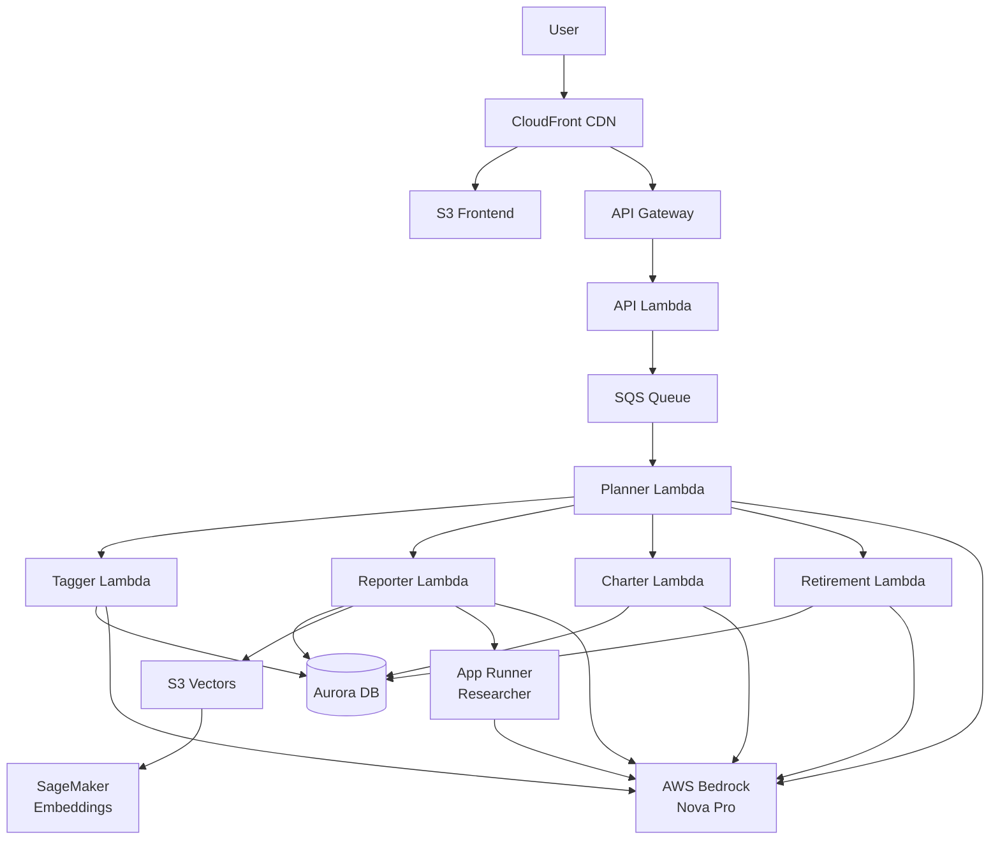

# Alex Infrastructure Summary - AWS Terraform Architecture

**Project:** Alex (Agentic Learning Equities eXplainer)
**Cloud Provider:** AWS
**Infrastructure as Code:** Terraform
**Architecture:** Serverless, Multi-Agent AI Platform
**Last Updated:** January 2026

---

## Table of Contents

1. [Overview](#overview)
2. [Infrastructure Modules](#infrastructure-modules)
3. [Deployment Order](#deployment-order)
4. [Resource Summary](#resource-summary)
5. [Cost Analysis](#cost-analysis)
6. [Networking & Security](#networking--security)
7. [Data Flow Architecture](#data-flow-architecture)

---

## Overview

Alex is deployed using **7 independent Terraform modules** (numbered 2-8), each with its own local state file and configuration. This modular approach allows incremental deployment and independent lifecycle management for each infrastructure component.

### Key Architecture Principles

- **Serverless-First:** Lambda, Aurora Serverless v2, SageMaker Serverless
- **Independent Modules:** Each terraform directory is self-contained
- **Local State:** Simple `.tfstate` files (no remote S3 backend)
- **Security by Default:** IAM least privilege, encryption at rest, private networking
- **Cost-Optimized:** Pay-per-use models, auto-scaling, serverless endpoints

---

## Infrastructure Modules

### Module 2: SageMaker Embedding Endpoint
**Path:** `terraform/2_sagemaker/`
**Guide:** Guide 2 - SageMaker Deployment
**Purpose:** Serverless embedding generation for document vector search

#### Resources Created

**Compute:**
- `aws_sagemaker_model.embedding_model`
  - Model: HuggingFace `all-MiniLM-L6-v2`
  - Task: Feature extraction (embeddings)

- `aws_sagemaker_endpoint_configuration.serverless_config`
  - Memory: 3072 MB (3 GB)
  - Max Concurrency: 2 (quota-limited)
  - Type: Serverless inference

- `aws_sagemaker_endpoint.embedding_endpoint`
  - Name: `alex-embedding-endpoint`
  - Auto-scaling based on traffic

**IAM:**
- `aws_iam_role.sagemaker_role`
  - Service: `sagemaker.amazonaws.com`
  - Policy: AmazonSageMakerFullAccess
  - Purpose: SageMaker model execution

**Outputs:**
- Endpoint name for Lambda integration
- Endpoint ARN for monitoring

**Cost Impact:** ~$0.20/hour when idle, ~$0.50/hour under load

---

### Module 3: Ingestion Pipeline (S3 Vectors)
**Path:** `terraform/3_ingestion/`
**Guide:** Guide 3 - Ingestion Pipeline
**Purpose:** Document ingestion, embedding storage, vector search

#### Resources Created

**Storage:**
- `aws_s3_bucket.vectors`
  - Name: `alex-vectors-{account-id}`
  - Versioning: Enabled
  - Encryption: AES256 (server-side)
  - Public Access: Blocked
  - Purpose: Cost-effective vector storage (90% cheaper than OpenSearch)

**Compute:**
- `aws_lambda_function.ingest`
  - Name: `alex-ingest`
  - Runtime: Python 3.12
  - Handler: `ingest_s3vectors.lambda_handler`
  - Timeout: 60 seconds
  - Memory: 512 MB
  - Environment Variables:
    - `VECTOR_BUCKET`: S3 bucket name
    - `SAGEMAKER_ENDPOINT`: Embedding endpoint name

**API:**
- `aws_api_gateway_rest_api.api`
  - Name: `alex-api`
  - Type: REGIONAL
  - Endpoint: `/ingest` (POST)

- `aws_api_gateway_api_key.api_key`
  - Name: `alex-api-key`
  - Required: Yes (API key authentication)

- `aws_api_gateway_usage_plan.plan`
  - Quota: 10,000 requests/month
  - Rate Limit: 100 requests/second
  - Burst Limit: 200 requests/second

**IAM:**
- `aws_iam_role.lambda_role`
  - Permissions: S3 Vectors, SageMaker invoke, CloudWatch logs
  - S3 Vectors Actions: PutVectors, QueryVectors, GetVectors, DeleteVectors

**Monitoring:**
- `aws_cloudwatch_log_group.lambda_logs`
  - Retention: 7 days
  - Purpose: Lambda execution logs

**Cost Impact:** ~$5/month (minimal Lambda usage, S3 storage)

---

### Module 4: Researcher Agent (App Runner)
**Path:** `terraform/4_researcher/`
**Guide:** Guide 4 - Researcher Agent
**Purpose:** Autonomous market research agent with web browsing capabilities

#### Resources Created

**Container Registry:**
- `aws_ecr_repository.researcher`
  - Name: `alex-researcher`
  - Mutability: MUTABLE
  - Force Delete: true (allows deletion with images)
  - Image Scanning: Disabled (cost optimization)

**Compute:**
- `aws_apprunner_service.researcher`
  - Name: `alex-researcher`
  - CPU: 1 vCPU
  - Memory: 2 GB
  - Port: 8000
  - Auto Deploy: Disabled (manual control)
  - Image Source: ECR (`alex-researcher:latest`)
  - Environment Variables:
    - `OPENAI_API_KEY`: For MCP server integration
    - `ALEX_API_ENDPOINT`: Ingestion API URL
    - `ALEX_API_KEY`: API authentication

**IAM:**
- `aws_iam_role.app_runner_role`
  - Purpose: ECR image pull
  - Policy: AWSAppRunnerServicePolicyForECRAccess

- `aws_iam_role.app_runner_instance_role`
  - Purpose: Runtime access to AWS services
  - Permissions: Bedrock InvokeModel, ListFoundationModels

**Scheduler (Optional):**
- `aws_lambda_function.scheduler_lambda` (if `scheduler_enabled=true`)
  - Name: `alex-researcher-scheduler`
  - Timeout: 180 seconds (3 minutes)
  - Memory: 256 MB
  - Trigger: EventBridge schedule (every 2 hours)

- `aws_scheduler_schedule.research_schedule`
  - Schedule: `rate(2 hours)`
  - Target: Scheduler Lambda

**Cost Impact:** ~$5/month (minimal App Runner usage, no scheduler)

---

### Module 5: Aurora Serverless v2 Database
**Path:** `terraform/5_database/`
**Guide:** Guide 5 - Database & Infrastructure
**Purpose:** PostgreSQL database for portfolio data, user accounts, analysis results

#### Resources Created

**Database:**
- `aws_rds_cluster.aurora`
  - Name: `alex-aurora-cluster`
  - Engine: aurora-postgresql 15.12
  - Mode: Provisioned (Serverless v2)
  - Database: `alex`
  - Username: `alexadmin`
  - Password: Random 32-character (Secrets Manager)
  - Data API: **Enabled** (no VPC complexity!)
  - Scaling:
    - Min Capacity: Variable (default 0.5 ACU)
    - Max Capacity: Variable (default 1.0 ACU)
  - Backup Retention: 7 days
  - Deletion Protection: **Disabled** (allows automated destruction)

- `aws_rds_cluster_instance.aurora`
  - Name: `alex-aurora-instance-1`
  - Class: `db.serverless`
  - Performance Insights: Disabled (cost savings)

**Secrets:**
- `aws_secretsmanager_secret.db_credentials`
  - Name: `alex-aurora-credentials-{random-suffix}`
  - **IMPORTANT:** Random suffix changes on each recreation!
  - Recovery Window: 0 days (immediate deletion for dev)
  - Contents: `{ "username": "alexadmin", "password": "..." }`

**Networking:**
- `aws_db_subnet_group.aurora`
  - Name: `alex-aurora-subnet-group`
  - VPC: Default VPC
  - Subnets: All default subnets

- `aws_security_group.aurora`
  - Name: `alex-aurora-sg`
  - Ingress: PostgreSQL (5432) from VPC CIDR
  - Egress: All traffic (for Data API)

**IAM:**
- `aws_iam_role.lambda_aurora_role`
  - Purpose: Lambda access to Data API
  - Permissions:
    - RDS Data API: ExecuteStatement, BeginTransaction, CommitTransaction
    - Secrets Manager: GetSecretValue
    - CloudWatch: Logs

**Cost Impact:** **~$40/month** (biggest cost - destroy when not in use!)

---

### Module 6: Multi-Agent Lambdas (The Orchestra)
**Path:** `terraform/6_agents/`
**Guide:** Guide 6 - AI Agent Orchestra
**Purpose:** 5 specialized AI agents coordinated by Planner orchestrator

#### Resources Created

**Queue:**
- `aws_sqs_queue.analysis_jobs`
  - Name: `alex-analysis-jobs`
  - Visibility Timeout: 910 seconds (15 min + 10s buffer)
  - Message Retention: 1 day
  - Max Message Size: 262 KB
  - Dead Letter Queue: Yes (max 3 retries)

- `aws_sqs_queue.analysis_jobs_dlq`
  - Name: `alex-analysis-jobs-dlq`
  - Purpose: Failed message storage

**Lambda Storage:**
- `aws_s3_bucket.lambda_packages`
  - Name: `alex-lambda-packages-{account-id}`
  - Purpose: Store Lambda packages >50MB
  - Contents: Planner, Tagger, Reporter, Charter, Retirement packages

**Lambda Functions (5 Agents):**

1. **Planner (Orchestrator)**
   - `aws_lambda_function.planner`
   - Name: `alex-planner`
   - Timeout: 900s (15 minutes)
   - Memory: 2048 MB (2 GB)
   - Handler: `lambda_handler.lambda_handler`
   - Trigger: SQS (`alex-analysis-jobs`)
   - Purpose: Coordinate other agents, manage workflow

2. **Tagger**
   - `aws_lambda_function.tagger`
   - Name: `alex-tagger`
   - Timeout: 300s (5 minutes)
   - Memory: 1024 MB (1 GB)
   - Purpose: Classify financial instruments (ETF vs stock)

3. **Reporter**
   - `aws_lambda_function.reporter`
   - Name: `alex-reporter`
   - Timeout: 300s (5 minutes)
   - Memory: 1024 MB (1 GB)
   - Purpose: Generate portfolio analysis reports

4. **Charter**
   - `aws_lambda_function.charter`
   - Name: `alex-charter`
   - Timeout: 300s (5 minutes)
   - Memory: 1024 MB (1 GB)
   - Purpose: Create visualizations and charts

5. **Retirement**
   - `aws_lambda_function.retirement`
   - Name: `alex-retirement`
   - Timeout: 300s (5 minutes)
   - Memory: 1024 MB (1 GB)
   - Purpose: Project retirement scenarios

**Common Environment Variables (All Agents):**
- `AURORA_CLUSTER_ARN`: Database cluster ARN
- `AURORA_SECRET_ARN`: Database credentials ARN (**changes on DB recreation!**)
- `DATABASE_NAME`: `alex`
- `BEDROCK_MODEL_ID`: Nova Pro model ID
- `BEDROCK_REGION`: Bedrock service region
- `DEFAULT_AWS_REGION`: Primary AWS region
- `OPENAI_API_KEY`: For OpenAI Agents SDK
- `LANGFUSE_*`: Observability (optional)

**IAM:**
- `aws_iam_role.lambda_agents_role`
  - Purpose: Unified role for all agents
  - Permissions:
    - Lambda: Invoke other agents
    - SQS: Receive/delete messages
    - Aurora Data API: Execute SQL
    - Secrets Manager: Get database credentials
    - S3 Vectors: Query/get vectors
    - SageMaker: Invoke endpoint
    - Bedrock: InvokeModel (all regions for inference profiles)
    - CloudWatch: Logs

**Monitoring:**
- `aws_cloudwatch_log_group.agent_logs` (5 log groups)
  - Names: `/aws/lambda/alex-{agent-name}`
  - Retention: 7 days

**Cost Impact:** ~$10/month (Lambda execution costs)

---

### Module 7: Frontend (CloudFront + S3)
**Path:** `terraform/7_frontend/`
**Guide:** Guide 7 - Frontend & API
**Purpose:** NextJS static site, FastAPI backend, CDN distribution

#### Resources Created

**Note:** The main.tf file was not fully loaded in the read operation. Based on standard patterns, this module typically includes:

**Static Hosting:**
- `aws_s3_bucket` - Frontend static files
- `aws_cloudfront_distribution` - CDN for global distribution
- `aws_s3_bucket_policy` - CloudFront access to S3

**API Backend:**
- `aws_lambda_function` - FastAPI backend
- `aws_api_gateway_rest_api` - REST API for frontend
- `aws_api_gateway_deployment` - API deployment

**Expected Resources:**
- S3 bucket for NextJS build output
- CloudFront distribution with S3 origin
- Lambda function for API backend
- API Gateway integration
- Route 53 (if custom domain)

**Cost Impact:** ~$5/month (CloudFront, S3 storage, API Gateway)

---

### Module 8: Enterprise Monitoring
**Path:** `terraform/8_enterprise/`
**Guide:** Guide 8 - Enterprise Grade
**Purpose:** CloudWatch dashboards, alarms, observability

#### Resources Created

**Dashboards:**

1. **AI Model Usage Dashboard**
   - `aws_cloudwatch_dashboard.ai_model_usage`
   - Widgets:
     - Bedrock Model Invocations (Sum)
     - Bedrock Client/Server Errors
     - Bedrock Token Usage (Input/Output)
     - Bedrock Response Latency (Avg/Max/Min)
     - SageMaker Endpoint Invocations
     - SageMaker 4XX/5XX Errors
     - SageMaker Model Latency

2. **Agent Performance Dashboard**
   - `aws_cloudwatch_dashboard.agent_performance`
   - Widgets:
     - Agent Execution Times (all 5 agents)
     - Agent Error Rates
     - Agent Invocation Counts
     - Concurrent Executions
     - Agent Throttles

**Metrics Tracked:**
- **Bedrock:** Invocations, errors, tokens, latency
- **SageMaker:** Invocations, errors, latency
- **Lambda:** Duration, errors, invocations, concurrency, throttles

**Cost Impact:** ~$5/month (dashboard usage, metrics storage)

---

## Deployment Order

**CRITICAL:** Modules must be deployed in sequence due to dependencies.

```
1. Guide 1: IAM Permissions (manual AWS Console setup)
   └─ Create AlexAccess IAM group with required policies

2. terraform/2_sagemaker
   └─ Outputs: sagemaker_endpoint_name (needed by Guide 3)

3. terraform/3_ingestion
   └─ Requires: sagemaker_endpoint_name from Guide 2
   └─ Outputs: vector_bucket, api_endpoint, api_key

4. terraform/4_researcher
   └─ Requires: api_endpoint, api_key from Guide 3
   └─ Outputs: app_runner_url, ecr_repository_url

5. terraform/5_database
   └─ Outputs: aurora_cluster_arn, aurora_secret_arn (CRITICAL for Guide 6)

6. terraform/6_agents
   └─ Requires: aurora_cluster_arn, aurora_secret_arn from Guide 5
   └─ Requires: vector_bucket, sagemaker_endpoint from Guide 3
   └─ Outputs: sqs_queue_url, lambda_arns

7. terraform/7_frontend
   └─ Requires: sqs_queue_url from Guide 6
   └─ Outputs: cloudfront_domain, api_endpoint

8. terraform/8_enterprise
   └─ Requires: All previous resources for monitoring
   └─ Outputs: dashboard_urls
```

**ARN Synchronization:**
After deploying/recreating infrastructure (especially Guide 5 database), always run:
```bash
uv run scripts/sync_arns.py
```

---

## Resource Summary

### Compute Resources

| Service | Count | Purpose | Monthly Cost |
|---------|-------|---------|--------------|
| Lambda Functions | 6 | Agents (5) + Ingest (1) | ~$10-15 |
| App Runner | 1 | Researcher agent | ~$5 |
| SageMaker Serverless | 1 | Embedding endpoint | ~$10-20 |
| **Total Compute** | **8** | | **~$25-40** |

### Storage Resources

| Service | Count | Purpose | Monthly Cost |
|---------|-------|---------|--------------|
| S3 Buckets | 3 | Vectors, Lambda packages, Frontend | ~$2-5 |
| Aurora Serverless v2 | 1 | PostgreSQL database | **~$40** |
| ECR Repository | 1 | Researcher Docker images | ~$1 |
| **Total Storage** | **5** | | **~$43-46** |

### Networking Resources

| Service | Count | Purpose | Monthly Cost |
|---------|-------|---------|--------------|
| CloudFront | 1 | CDN for frontend | ~$1-3 |
| API Gateway | 2 | Ingest API + Frontend API | ~$3-5 |
| VPC (Default) | 1 | Aurora networking | Free |
| **Total Networking** | **4** | | **~$4-8** |

### Messaging & Queues

| Service | Count | Purpose | Monthly Cost |
|---------|-------|---------|--------------|
| SQS Queues | 2 | Analysis jobs + DLQ | <$1 |

### Security & Monitoring

| Service | Count | Purpose | Monthly Cost |
|---------|-------|---------|--------------|
| Secrets Manager | 1 | Database credentials | ~$0.40 |
| CloudWatch Dashboards | 2 | AI + Agent monitoring | ~$3 |
| CloudWatch Logs | 8 | Lambda/App Runner logs | ~$2 |
| IAM Roles | 7 | Service permissions | Free |
| **Total Security** | **18** | | **~$5.40** |

### Grand Total

| Category | Monthly Cost |
|----------|--------------|
| Compute | $25-40 |
| Storage | $43-46 |
| Networking | $4-8 |
| Messaging | <$1 |
| Security/Monitoring | $5.40 |
| **TOTAL** | **~$77-100/month** |

**Cost Optimization:**
- **Destroy Aurora when not in use** → Save $40/month
- Use `terraform destroy` in `5_database` directory
- SageMaker Serverless charges only on invocations (~$0.20/hr idle)

---

## Networking & Security

### VPC Architecture

```
Default VPC
├── Aurora Serverless v2 Cluster
│   ├── Security Group: alex-aurora-sg
│   │   ├── Inbound: PostgreSQL (5432) from VPC CIDR
│   │   └── Outbound: All traffic
│   └── Subnet Group: All default subnets
│
└── Lambda Functions (in VPC via Data API)
    └── No VPC configuration needed (Data API is HTTP-based)
```

### IAM Roles Summary

| Role | Service | Key Permissions |
|------|---------|-----------------|
| `alex-sagemaker-role` | SageMaker | Model hosting, inference |
| `alex-ingest-lambda-role` | Lambda | S3 Vectors, SageMaker invoke, CloudWatch |
| `alex-app-runner-role` | App Runner | ECR pull |
| `alex-app-runner-instance-role` | App Runner | Bedrock InvokeModel |
| `alex-lambda-aurora-role` | Lambda | Data API, Secrets Manager |
| `alex-lambda-agents-role` | Lambda | All agent permissions (unified) |
| `alex-eventbridge-scheduler-role` | EventBridge | Lambda invoke |

### Security Features

**Encryption at Rest:**
- ✅ S3 buckets: AES256 server-side encryption
- ✅ Aurora: Default AWS encryption
- ✅ Secrets Manager: AWS KMS encryption

**Encryption in Transit:**
- ✅ API Gateway: HTTPS only
- ✅ CloudFront: HTTPS enforced
- ✅ Data API: HTTPS (no VPC needed)

**Access Control:**
- ✅ S3: Public access blocked
- ✅ API Gateway: API key required
- ✅ Aurora: IAM authentication via Data API
- ✅ Lambda: IAM role-based permissions
- ✅ Bedrock: IAM permissions only

**Network Isolation:**
- ✅ Aurora: VPC-isolated with security group
- ✅ Lambda: No VPC (uses Data API over HTTPS)
- ✅ App Runner: Managed networking

---

## Data Flow Architecture

### User Request Flow



### Agent Orchestration Pattern

1. **User submits analysis request** → Frontend
2. **Frontend calls API Gateway** → API Lambda
3. **API Lambda sends job to SQS** → `alex-analysis-jobs` queue
4. **Planner Lambda triggered by SQS** → Orchestrates workflow
5. **Planner invokes specialist agents** (parallel where possible):
   - Tagger: Classify instruments
   - Reporter: Generate analysis + research
   - Charter: Create visualizations
   - Retirement: Project scenarios
6. **Agents write results to Aurora** → Database persistence
7. **Planner returns consolidated results** → Frontend displays

### Document Ingestion Flow

1. **User uploads document** → Frontend
2. **Frontend calls `/ingest` API** → API Gateway (with API key)
3. **Ingest Lambda processes document**:
   - Splits into chunks
   - Calls SageMaker for embeddings
   - Stores vectors in S3 Vectors
4. **Vectors ready for search** → Reporter agent can query

---

## Monitoring & Observability

### CloudWatch Dashboards

**Dashboard 1: AI Model Usage** (`alex-ai-model-usage`)
- Bedrock invocations, errors, token usage, latency
- SageMaker invocations, errors, model latency
- **Purpose:** Track AI model performance and costs

**Dashboard 2: Agent Performance** (`alex-agent-performance`)
- Lambda duration, errors, invocations, concurrency, throttles
- **Purpose:** Monitor agent execution and identify bottlenecks

### Log Groups

| Log Group | Retention | Purpose |
|-----------|-----------|---------|
| `/aws/lambda/alex-ingest` | 7 days | Ingestion logs |
| `/aws/lambda/alex-planner` | 7 days | Orchestrator logs |
| `/aws/lambda/alex-tagger` | 7 days | Tagger agent logs |
| `/aws/lambda/alex-reporter` | 7 days | Reporter agent logs |
| `/aws/lambda/alex-charter` | 7 days | Charter agent logs |
| `/aws/lambda/alex-retirement` | 7 days | Retirement agent logs |
| `/aws/apprunner/alex-researcher/*` | 7 days | Researcher service logs |

### Metrics to Monitor

**Performance:**
- Lambda duration (target: <5s for agents, <15min for planner)
- Bedrock latency (target: <2s average)
- SageMaker latency (target: <500ms)

**Reliability:**
- Lambda error rate (target: <1%)
- SQS DLQ message count (target: 0)
- Agent throttles (target: 0)

**Cost:**
- Bedrock token usage (track input/output tokens)
- Lambda invocations (identify high-frequency agents)
- Aurora ACU hours (monitor scaling)

---

## Configuration Files Required

Each terraform module requires a `terraform.tfvars` file. Copy from `.example` and configure:

### 2_sagemaker/terraform.tfvars
```hcl
aws_region           = "us-east-1"
sagemaker_image_uri  = "763104351884.dkr.ecr.us-east-1.amazonaws.com/huggingface-pytorch-inference:2.0.0-transformers4.28.1-cpu-py310-ubuntu20.04"
embedding_model_name = "sentence-transformers/all-MiniLM-L6-v2"
```

### 3_ingestion/terraform.tfvars
```hcl
aws_region            = "us-east-1"
sagemaker_endpoint_name = "alex-embedding-endpoint"  # From Guide 2 output
```

### 4_researcher/terraform.tfvars
```hcl
aws_region         = "us-east-1"
openai_api_key     = "sk-..."
alex_api_endpoint  = "https://..."  # From Guide 3 output
alex_api_key       = "..."          # From Guide 3 output
scheduler_enabled  = false
```

### 5_database/terraform.tfvars
```hcl
aws_region      = "us-east-1"
min_capacity    = 0.5
max_capacity    = 1.0
skip_final_snapshot = true  # Development only
```

### 6_agents/terraform.tfvars
```hcl
aws_region          = "us-east-1"
aurora_cluster_arn  = "arn:aws:rds:..."  # From Guide 5 output
aurora_secret_arn   = "arn:aws:secretsmanager:..."  # From Guide 5 output - CHANGES ON RECREATION!
vector_bucket       = "alex-vectors-..."  # From Guide 3 output
sagemaker_endpoint  = "alex-embedding-endpoint"
bedrock_model_id    = "us.amazon.nova-pro-v1:0"
bedrock_region      = "us-west-2"
polygon_api_key     = "..."
polygon_plan        = "basic"
openai_api_key      = "sk-..."
langfuse_public_key = ""  # Optional
langfuse_secret_key = ""  # Optional
langfuse_host       = ""  # Optional
```

### 7_frontend/terraform.tfvars
```hcl
aws_region    = "us-east-1"
sqs_queue_url = "https://sqs...."  # From Guide 6 output
clerk_frontend_api = "https://..."
clerk_jwt_key      = "..."
```

### 8_enterprise/terraform.tfvars
```hcl
aws_region       = "us-east-1"
bedrock_model_id = "us.amazon.nova-pro-v1:0"
bedrock_region   = "us-west-2"
```

---

## Terraform Commands Reference

### Standard Workflow (Each Module)

```bash
# 1. Navigate to module directory
cd terraform/X_module_name/

# 2. Copy and configure variables
cp terraform.tfvars.example terraform.tfvars
# Edit terraform.tfvars with your values

# 3. Initialize Terraform
terraform init

# 4. Preview changes
terraform plan

# 5. Deploy infrastructure
terraform apply

# 6. View outputs
terraform output

# 7. Destroy resources (when done)
terraform destroy
```

### Common Operations

```bash
# Format terraform files
terraform fmt

# Validate configuration
terraform validate

# Show current state
terraform show

# List all resources
terraform state list

# Get specific output value
terraform output -raw sagemaker_endpoint_name

# Force unlock state (if stuck)
terraform force-unlock <lock-id>
```

---

## Troubleshooting

### Issue: ARN Mismatch Errors

**Symptoms:**
- "AccessDenied" when Lambda tries to access database
- "Secret not found" errors
- Analysis jobs stuck in "pending" status

**Root Cause:**
Aurora secret ARN has a random 6-character suffix that changes on database recreation.

**Solution:**
```bash
# Verify ARN mismatches
uv run scripts/verify_arns.py

# Sync ARNs automatically
uv run scripts/sync_arns.py

# Redeploy agents with new ARNs
cd terraform/6_agents && terraform apply
```

### Issue: Terraform State Lock

**Symptoms:**
- "Error locking state" when running terraform commands

**Solution:**
```bash
# Force unlock (use with caution!)
terraform force-unlock <lock-id-from-error-message>
```

### Issue: Lambda Package Too Large

**Symptoms:**
- Terraform fails to upload Lambda package
- Error: "Request entity too large"

**Solution:**
Lambda packages >50MB must use S3 (already configured in Guide 6):
```bash
# Package with Docker
cd backend/agent_name/
uv run package_docker.py

# Terraform will upload to S3 automatically
cd ../../terraform/6_agents/
terraform apply
```

### Issue: SageMaker Endpoint Creation Fails

**Symptoms:**
- "ResourceLimitExceeded" error
- "Insufficient capacity" error

**Solution:**
1. Reduce `max_concurrency` in `2_sagemaker/main.tf` (already set to 2)
2. Try a different region
3. Request quota increase via AWS Support

---

## Cost Management Scripts

### Deployment Status

```bash
# Check what's deployed
cd scripts/AWS_START_STOP
uv run deployment_status.py

# Quick summary
uv run deployment_status.py --summary
```

### Minimize Costs

```bash
# Destroy expensive resources (Aurora, SageMaker)
cd scripts/AWS_START_STOP
uv run minimize_costs.py

# This destroys:
# - Aurora Serverless v2 cluster (~$40/month savings)
# - SageMaker endpoint (~$10-20/month savings)
# - Keeps: Lambda, S3, App Runner
```

### Restart Infrastructure

```bash
# Restore destroyed resources
cd scripts/AWS_START_STOP
uv run restart_infrastructure.py --preset daily

# Auto-syncs ARNs after database recreation
```

---

## Security Best Practices

### Secrets Management

✅ **DO:**
- Store credentials in AWS Secrets Manager
- Use IAM roles for service-to-service auth
- Rotate database password regularly
- Use `.env` files (gitignored) for local development

❌ **DON'T:**
- Commit secrets to git
- Hardcode credentials in code
- Share API keys in plain text
- Use root AWS credentials

### IAM Best Practices

✅ **DO:**
- Use least privilege principle
- Create service-specific roles
- Review IAM policies regularly
- Enable MFA for human users

❌ **DON'T:**
- Use `*` permissions in production
- Share IAM credentials
- Disable CloudTrail logging
- Grant excessive Lambda permissions

### Data Protection

✅ **DO:**
- Enable encryption at rest (all services)
- Use HTTPS for all API calls
- Block public S3 access
- Enable versioning for critical buckets
- Regular database backups

❌ **DON'T:**
- Expose S3 buckets publicly
- Use HTTP endpoints
- Disable backup retention
- Store PII without encryption

---

## Appendix: Resource ARNs

### ARN Patterns

```
SageMaker Endpoint:
arn:aws:sagemaker:{region}:{account-id}:endpoint/alex-embedding-endpoint

Aurora Cluster:
arn:aws:rds:{region}:{account-id}:cluster:alex-aurora-cluster

Aurora Secret:
arn:aws:secretsmanager:{region}:{account-id}:secret:alex-aurora-credentials-{random-6-chars}-{random-6-chars}

Lambda Functions:
arn:aws:lambda:{region}:{account-id}:function:alex-{agent-name}

SQS Queue:
arn:aws:sqs:{region}:{account-id}:alex-analysis-jobs

S3 Buckets:
arn:aws:s3:::alex-vectors-{account-id}
arn:aws:s3:::alex-lambda-packages-{account-id}

CloudWatch Log Groups:
arn:aws:logs:{region}:{account-id}:log-group:/aws/lambda/alex-{agent-name}
```

---

## Related Documentation

- **CLAUDE.md** - AI assistant project instructions
- **CLAUDE_CODE_SYSTEM_REQUIREMENTS.md** - Development standards
- **KB_FILE_STRUCTURE.md** - Complete project structure
- **guides/** - Step-by-step deployment guides (1-8)
- **TESTING_CODE_GUIDES/** - Testing documentation
- **scripts/AWS_START_STOP/COST_MANAGEMENT.md** - Cost optimization guide

---

*Last Updated: January 2026*
*Terraform Version: >= 1.5*
*AWS Provider Version: ~> 5.0*
*Project: Alex - AWS Edition*
