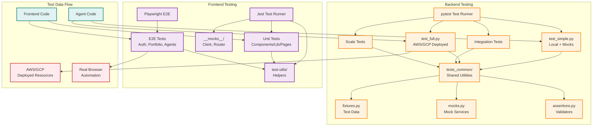
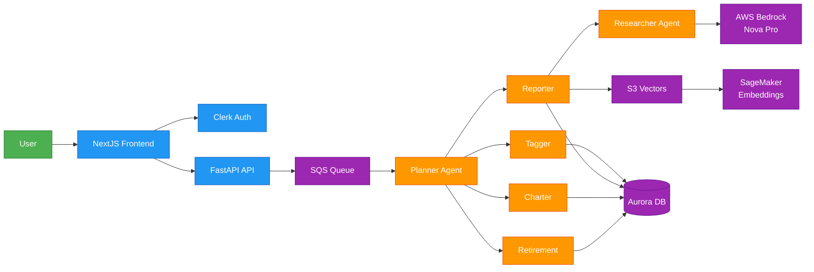

# Alex Project - File Structure

```mermaid
graph TB
    ROOT[alex/]

    %% Top Level Directories
    ROOT --> GUIDES[guides/]
    ROOT --> BACKEND[backend/]
    ROOT --> FRONTEND[frontend/]
    ROOT --> TERRAFORM_AWS[terraform/<br/>AWS Infrastructure]
    ROOT --> TERRAFORM_GCP[terraform_GCP/<br/>GCP Infrastructure]
    ROOT --> SCRIPTS[scripts/]
    ROOT --> UTILITIES[KB_github_UTILITIES/<br/>Git Tools]
    ROOT --> TESTING_GUIDES[TESTING_CODE_GUIDES/<br/>Test Documentation]
    ROOT --> DOCS[📄 Documentation]

    %% Documentation Files
    DOCS --> CLAUDE[CLAUDE.md<br/>AI Assistant Guide]
    DOCS --> CLAUDE_REQS[CLAUDE_CODE_SYSTEM_REQUIREMENTS.md<br/>System Requirements]
    DOCS --> README[README.md<br/>Main Overview]
    DOCS --> KB_STRUCTURE[KB_FILE_STRUCTURE.md<br/>This File]
    DOCS --> KB_PROMPT[KB_PROMPT_GRAPHICAL.md<br/>Doc Template]
    DOCS --> TEMPLATE_AWS[TEMPLATE_AWS.md<br/>AWS Templates]
    DOCS --> TEMPLATE_CONSTRUCT[TEMPLATE_CONSTRUCT.md<br/>Build Templates]
    DOCS --> GITHUB_BP[GITHUB_BEST_PRACTICES.md]
    DOCS --> START_SERVER[START_SERVER_README.md]

    %% Guides Directory
    GUIDES --> G_INFO[Course Guides<br/>8-Day Curriculum]

    %% Backend Directory - AWS Agents
    BACKEND --> B_AWS_AGENTS[AWS Agents]
    BACKEND --> B_GCP_AGENTS[GCP Agents]
    BACKEND --> B_SHARED[Shared Infrastructure]
    BACKEND --> B_TESTING[Testing]

    B_AWS_AGENTS --> PLANNER[planner/<br/>Orchestrator]
    B_AWS_AGENTS --> TAGGER[tagger/<br/>Classifier]
    B_AWS_AGENTS --> REPORTER[reporter/<br/>Analysis]
    B_AWS_AGENTS --> REPORTER_1[reporter_1/<br/>Analysis v1]
    B_AWS_AGENTS --> CHARTER[charter/<br/>Visualization]
    B_AWS_AGENTS --> RETIREMENT[retirement/<br/>Projections]
    B_AWS_AGENTS --> RESEARCHER[researcher/<br/>Market Research]

    B_GCP_AGENTS --> TAGGER_GCP[tagger_gcp/<br/>GCP Classifier]

    B_SHARED --> INGEST[ingest/<br/>Document Ingestion]
    B_SHARED --> DATABASE[database/<br/>AWS Aurora Library]
    B_SHARED --> DATABASE_GCP[database_gcp/<br/>GCP CloudSQL Library]
    B_SHARED --> API[api/<br/>FastAPI Backend]
    B_SHARED --> SCHEDULER[scheduler/<br/>Job Scheduling]

    B_TESTING --> TESTS_COMMON[tests_common/<br/>Shared Test Utils]

    %% Agent Structure (Example)
    PLANNER --> P_LAMBDA[lambda_handler.py]
    PLANNER --> P_AGENT[agent.py]
    PLANNER --> P_TEMPLATES[templates.py]
    PLANNER --> P_TEST1[test_simple.py]
    PLANNER --> P_TEST2[test_full.py]
    PLANNER --> P_PACKAGE[package_docker.py]
    PLANNER --> P_ENV[.env.example]
    PLANNER --> P_UV[pyproject.toml]

    %% Frontend Directory
    FRONTEND --> F_PAGES[pages/]
    FRONTEND --> F_COMPONENTS[components/]
    FRONTEND --> F_LIB[lib/]
    FRONTEND --> F_PUBLIC[public/]
    FRONTEND --> F_STYLES[styles/]
    FRONTEND --> F_TESTING[Testing]
    FRONTEND --> F_OUT[out/<br/>Build Output]

    F_TESTING --> F_TESTS[__tests__/<br/>Unit Tests]
    F_TESTING --> F_E2E[e2e/<br/>E2E Tests]
    F_TESTING --> F_MOCKS[__mocks__/<br/>Test Mocks]
    F_TESTING --> F_UTILS[test-utils/<br/>Test Utilities]

    %% Terraform AWS Directory
    TERRAFORM_AWS --> TF2[2_sagemaker/<br/>SageMaker Embeddings]
    TERRAFORM_AWS --> TF3[3_ingestion/<br/>S3 Vectors + Lambda]
    TERRAFORM_AWS --> TF4[4_researcher/<br/>App Runner Service]
    TERRAFORM_AWS --> TF5[5_database/<br/>Aurora Serverless]
    TERRAFORM_AWS --> TF6[6_agents/<br/>Multi-agent Lambdas]
    TERRAFORM_AWS --> TF7[7_frontend/<br/>CloudFront + S3]
    TERRAFORM_AWS --> TF8[8_enterprise/<br/>Monitoring]

    %% Terraform GCP Directory
    TERRAFORM_GCP --> TFG0[0_foundation/<br/>GCP Project Setup]
    TERRAFORM_GCP --> TFG1[1_network/<br/>VPC & Networking]
    TERRAFORM_GCP --> TFG2[2_embeddings/<br/>Vertex AI Embeddings]
    TERRAFORM_GCP --> TFG3[3_ingestion/<br/>GCS + Cloud Functions]
    TERRAFORM_GCP --> TFG4[4_researcher/<br/>Cloud Run Service]
    TERRAFORM_GCP --> TFG5[5_database/<br/>Cloud SQL PostgreSQL]
    TERRAFORM_GCP --> TFG6[6_agents/<br/>Cloud Run Agents]
    TERRAFORM_GCP --> TFG7[7_frontend/<br/>Cloud CDN + Storage]
    TERRAFORM_GCP --> TFG8[8_monitoring/<br/>Cloud Monitoring]

    %% Scripts Directory
    SCRIPTS --> S_DEPLOY[deploy.py]
    SCRIPTS --> S_RUN[run_local.py]
    SCRIPTS --> S_DESTROY[destroy.py]
    SCRIPTS --> S_MULTI[deploy_multi_cloud.py<br/>destroy_multi_cloud.py]
    SCRIPTS --> S_AWS[AWS_START_STOP/]
    SCRIPTS --> S_QUICK[QUICKSTART.md<br/>README_MULTI_CLOUD.md]
    SCRIPTS --> S_SERVER[start_dev_server.py<br/>stop_dev_server.py]

    %% Utilities Directory
    UTILITIES --> U_GIT[git_utilities/<br/>Python Git Tools]
    UTILITIES --> U_BASH[BASH_CODE/<br/>Shell Scripts]

    %% Testing Guides Directory
    TESTING_GUIDES --> TG_GUIDE[TESTING_GUIDE.md]
    TESTING_GUIDES --> TG_IMPL[TESTING_IMPLEMENTATION_SUMMARY.md]
    TESTING_GUIDES --> TG_QUICK[TESTING_QUICK_REFERENCE.md]

    %% Styling
    classDef guidesStyle fill:#e1f5ff,stroke:#0288d1,stroke-width:2px
    classDef backendStyle fill:#fff3e0,stroke:#f57c00,stroke-width:2px
    classDef frontendStyle fill:#f3e5f5,stroke:#7b1fa2,stroke-width:2px
    classDef terraformStyle fill:#e8f5e9,stroke:#388e3c,stroke-width:2px
    classDef gcpStyle fill:#c8e6c9,stroke:#2e7d32,stroke-width:2px
    classDef scriptsStyle fill:#fff9c4,stroke:#f9a825,stroke-width:2px
    classDef docsStyle fill:#fce4ec,stroke:#c2185b,stroke-width:2px
    classDef utilsStyle fill:#e0f2f1,stroke:#00796b,stroke-width:2px
    classDef testingStyle fill:#ffebee,stroke:#c62828,stroke-width:2px

    class GUIDES,G_INFO guidesStyle
    class BACKEND,B_AWS_AGENTS,B_GCP_AGENTS,B_SHARED,B_TESTING,PLANNER,TAGGER,REPORTER,REPORTER_1,CHARTER,RETIREMENT,RESEARCHER,TAGGER_GCP,INGEST,DATABASE,DATABASE_GCP,API,SCHEDULER,TESTS_COMMON backendStyle
    class FRONTEND,F_PAGES,F_COMPONENTS,F_LIB,F_PUBLIC,F_STYLES,F_TESTING,F_TESTS,F_E2E,F_MOCKS,F_UTILS,F_OUT frontendStyle
    class TERRAFORM_AWS,TF2,TF3,TF4,TF5,TF6,TF7,TF8 terraformStyle
    class TERRAFORM_GCP,TFG0,TFG1,TFG2,TFG3,TFG4,TFG5,TFG6,TFG7,TFG8 gcpStyle
    class SCRIPTS,S_DEPLOY,S_RUN,S_DESTROY,S_MULTI,S_AWS,S_QUICK,S_SERVER scriptsStyle
    class DOCS,CLAUDE,CLAUDE_REQS,README,KB_STRUCTURE,KB_PROMPT,TEMPLATE_AWS,TEMPLATE_CONSTRUCT,GITHUB_BP,START_SERVER docsStyle
    class UTILITIES,U_GIT,U_BASH utilsStyle
    class TESTING_GUIDES,TG_GUIDE,TG_IMPL,TG_QUICK testingStyle
```



## Directory Purpose Overview

### 📚 Guides (Week 3-4 Course Content)
Step-by-step deployment guides for the 8-day course. Start with Guide 1 and progress sequentially.

**Week 3: Research Infrastructure**
- Day 3: Guides 1-2 (Permissions, SageMaker)
- Day 4: Guide 3 (Ingestion Pipeline)
- Day 5: Guide 4 (Researcher Agent)

**Week 4: Portfolio Management Platform**
- Day 1: Guide 5 (Database)
- Day 2: Guide 6 (Agent Orchestra)
- Day 3: Guide 7 (Frontend)
- Day 4: Guide 8 (Enterprise Features)

### 🔧 Backend (Python/uv projects)
All AI agents and Lambda functions using OpenAI Agents SDK.

**AWS Agents:**
- **Planner**: Orchestrator that coordinates other agents
- **Tagger**: Classifies financial instruments (ETF vs stock)
- **Reporter**: Analyzes portfolio and generates reports (active version)
- **Reporter_1**: Previous version of reporter agent
- **Charter**: Creates visualizations and charts
- **Retirement**: Projects retirement scenarios
- **Researcher**: Autonomous market research (App Runner)

**GCP Agents:**
- **Tagger_GCP**: GCP Cloud Run version of tagger agent

**Shared Infrastructure:**
- **Ingest**: Document ingestion Lambda for S3 Vectors
- **Database**: Shared library for AWS Aurora Data API
- **Database_GCP**: Shared library for GCP Cloud SQL
- **API**: FastAPI backend for frontend integration
- **Scheduler**: Job scheduling and task management

**Testing:**
- **tests_common**: Shared testing utilities and fixtures

### 🎨 Frontend (NextJS React)
- **pages/**: NextJS page routes (Pages Router)
- **components/**: React components
- **lib/**: Utilities and API clients
- **public/**: Static assets
- **styles/**: CSS and styling files
- **out/**: Build output directory
- **__tests__/**: Unit tests with Jest and React Testing Library
- **e2e/**: End-to-end tests with Playwright
- **__mocks__/**: Test mocks for external dependencies
- **test-utils/**: Shared testing utilities and custom renderers

### 🏗️ Terraform AWS (Infrastructure as Code)
Each directory is **independent** with its own state file and tfvars.

**AWS Deployment Order:**
1. 2_sagemaker (SageMaker Embedding endpoint)
2. 3_ingestion (S3 Vectors + Lambda)
3. 4_researcher (App Runner)
4. 5_database (Aurora Serverless v2)
5. 6_agents (Multi-agent Lambdas)
6. 7_frontend (CloudFront + S3 + API Gateway)
7. 8_enterprise (CloudWatch Monitoring)

### 🌐 Terraform GCP (Infrastructure as Code)
Multi-cloud support with GCP deployment.

**GCP Deployment Order:**
1. 0_foundation (GCP Project and IAM setup)
2. 1_network (VPC, subnets, firewall rules)
3. 2_embeddings (Vertex AI embedding endpoint)
4. 3_ingestion (Cloud Storage + Cloud Functions)
5. 4_researcher (Cloud Run service)
6. 5_database (Cloud SQL PostgreSQL)
7. 6_agents (Cloud Run agents)
8. 7_frontend (Cloud CDN + Cloud Storage)
9. 8_monitoring (Cloud Monitoring dashboards)

### 🛠️ Scripts
- **deploy.py**: Frontend deployment automation
- **run_local.py**: Local development testing
- **destroy.py**: Cleanup and resource destruction
- **deploy_multi_cloud.py**: Multi-cloud deployment orchestration
- **destroy_multi_cloud.py**: Multi-cloud cleanup
- **start_dev_server.py**: Start local development server
- **stop_dev_server.py**: Stop local development server
- **AWS_START_STOP/**: AWS cost management utilities
- **QUICKSTART.md**: Quick start guide
- **README_MULTI_CLOUD.md**: Multi-cloud deployment guide

### 🔧 KB_github_UTILITIES
Universal Git workflow tools.
- **git_utilities/**: Python-based Git automation scripts
- **BASH_CODE/**: Shell script utilities

### 🧪 TESTING_CODE_GUIDES
Comprehensive testing documentation and guides.
- **TESTING_GUIDE.md**: Complete testing strategy and implementation guide
- **TESTING_IMPLEMENTATION_SUMMARY.md**: Detailed summary of testing implementation across the project
- **TESTING_QUICK_REFERENCE.md**: Quick reference for common testing tasks and commands

## Testing Infrastructure

### Backend Testing (Python/pytest)

**Test Organization:**
```
backend/
├── tests_common/              # Shared testing utilities
│   ├── __init__.py           # Package initialization
│   ├── fixtures.py           # Reusable test fixtures
│   ├── mocks.py              # Mock objects for AWS/GCP services
│   └── assertions.py         # Custom test assertions
│
├── test_simple.py            # Integration tests (mock mode)
├── test_full.py              # End-to-end tests (real AWS)
├── test_multiple_accounts.py # Multi-user testing
├── test_scale.py             # Performance/scale testing
│
└── */                        # Each agent directory contains:
    ├── test_simple.py        # Local tests with mocks
    └── test_full.py          # AWS/GCP deployment tests
```

**Agent Test Files (23 total):**
- `backend/planner/test_simple.py`, `test_full.py`, `test_market.py`
- `backend/tagger/test_simple.py`, `test_full.py`
- `backend/reporter/test_simple.py`, `test_full.py`
- `backend/reporter_1/test_simple.py`, `test_full.py`
- `backend/charter/test_simple.py`, `test_full.py`
- `backend/retirement/test_simple.py`, `test_full.py`
- `backend/researcher/test_local.py`, `test_research.py`
- `backend/ingest/test_ingest_s3vectors.py`, `test_search_s3vectors.py`
- `backend/database/test_data_api.py`
- `backend/database_gcp/test_client.py`

**Test Types:**
1. **test_simple.py**: Local testing with MOCK_LAMBDAS=true
   - Fast execution (no AWS/GCP calls)
   - Uses mocked services from `tests_common/mocks.py`
   - Tests agent logic and prompts

2. **test_full.py**: Deployment testing
   - Real AWS Lambda/GCP Cloud Run invocations
   - Tests actual cloud infrastructure
   - Requires deployed resources

3. **Integration tests**: Full workflow testing
   - Multi-agent orchestration
   - Database integration
   - Queue processing

4. **Scale tests**: Performance validation
   - Concurrent user testing
   - Load testing
   - Resource optimization

### Frontend Testing (Jest/Playwright)

**Test Organization:**
```
frontend/
├── __tests__/                # Unit tests
│   ├── components/          # Component tests
│   ├── lib/                 # Library/utility tests
│   └── pages/               # Page tests
│
├── e2e/                     # End-to-end tests
│   ├── auth.spec.ts         # Authentication flows
│   ├── portfolio.spec.ts    # Portfolio management
│   └── agents.spec.ts       # Agent interactions
│
├── __mocks__/               # Test mocks
│   ├── clerk.ts             # Clerk auth mocks
│   └── next-router.ts       # Next.js router mocks
│
└── test-utils/              # Testing utilities
    ├── render.tsx           # Custom render with providers
    ├── mock-data.ts         # Mock data generators
    └── test-helpers.ts      # Helper functions
```

**Test Types:**
1. **Unit Tests (Jest + React Testing Library)**
   - Component rendering
   - User interactions
   - State management
   - API client logic

2. **E2E Tests (Playwright)**
   - Full user workflows
   - Browser automation
   - Cross-browser testing
   - Visual regression testing

3. **Integration Tests**
   - API integration
   - Authentication flows
   - Data fetching

### Testing Utilities (tests_common/)

**fixtures.py**: Reusable test data and setup
- Portfolio fixtures
- User data fixtures
- Database fixtures
- API response fixtures

**mocks.py**: Mock implementations
- AWS service mocks (Lambda, SQS, Aurora, Bedrock)
- GCP service mocks (Cloud Run, Cloud SQL, Vertex AI)
- External API mocks
- Database mocks

**assertions.py**: Custom test assertions
- Agent output validation
- JSON schema validation
- Response format checking
- Error message validation

### Test Execution Commands

**Backend:**
```bash
# Run all tests with mocks
cd backend && uv run pytest

# Run specific agent tests (local)
cd backend/planner && uv run pytest test_simple.py

# Run deployment tests (requires AWS/GCP)
cd backend/planner && uv run pytest test_full.py

# Run with coverage
cd backend && uv run pytest --cov=. --cov-report=html
```

**Frontend:**
```bash
# Run unit tests
cd frontend && npm test

# Run unit tests in watch mode
cd frontend && npm run test:watch

# Run E2E tests
cd frontend && npm run test:e2e

# Run E2E tests in UI mode
cd frontend && npm run test:e2e:ui
```

### Testing Best Practices

1. **Mock by default**: Use `test_simple.py` for fast iteration
2. **Test deployments**: Use `test_full.py` before production
3. **Shared utilities**: Leverage `tests_common/` for consistency
4. **Coverage tracking**: Maintain >80% code coverage
5. **CI/CD integration**: Automated testing in GitHub Actions

### Testing Architecture



### Test Coverage Summary

**Backend:**
- 23+ test files across all agents
- Integration tests for multi-agent workflows
- Mock mode for fast local development
- Deployment tests for production validation
- Scale tests for performance validation

**Frontend:**
- Unit tests for all components, pages, and utilities
- E2E tests covering critical user workflows
- Mock implementations for external dependencies
- Custom test utilities for consistent testing

**Shared:**
- Centralized test fixtures and mocks
- Reusable assertions and validators
- Consistent testing patterns across codebase

## Key Files to Configure

### Environment Variables
```
📄 .env (root)                         # Backend configuration
📄 frontend/.env.local                 # Clerk authentication
📄 backend/*/.env.example              # Agent-specific configs (AWS)
📄 backend/tagger_gcp/.env.example     # GCP-specific configs
```

### Terraform Variables
```
📄 terraform/*/terraform.tfvars        # AWS - Must create from .example
📄 terraform_GCP/*/terraform.tfvars    # GCP - Must create from .example
```

### Package Management
```
📄 backend/*/pyproject.toml            # uv project files
📄 frontend/package.json               # npm dependencies
📄 frontend/package-lock.json          # npm lock file
```

### Documentation Files
```
📄 CLAUDE.md                           # AI assistant instructions (with imports)
📄 CLAUDE_CODE_SYSTEM_REQUIREMENTS.md  # Claude Code system requirements (auto-loaded)
📄 KB_FILE_STRUCTURE.md                # This file - project structure (auto-loaded)
📄 KB_PROMPT_GRAPHICAL.md              # Template for creating docs
📄 README.md                           # Project overview
📄 TEMPLATE_AWS.md                     # AWS deployment templates
📄 TEMPLATE_CONSTRUCT.md               # Construction templates
📄 GITHUB_BEST_PRACTICES.md            # Git workflow best practices
📄 START_SERVER_README.md              # Server startup instructions
📄 gameplan.md                         # Project gameplan
📄 course.md                           # Course notes
```

### Testing Documentation (see TESTING_CODE_GUIDES/)
```
📄 TESTING_GUIDE.md                    # Complete testing guide
📄 TESTING_IMPLEMENTATION_SUMMARY.md   # Implementation details
📄 TESTING_QUICK_REFERENCE.md          # Quick reference
```

### Claude Code Import Mechanism

This project uses Claude Code's **import functionality** to automatically load documentation files into every session.

**How It Works:**
1. The file `/alex/CLAUDE.md` contains import directives at the top:
   ```markdown
   @./CLAUDE_CODE_SYSTEM_REQUIREMENTS.md
   @./KB_FILE_STRUCTURE.md
   ```
2. When Claude Code starts a session in this project, it:
   - Reads CLAUDE.md
   - Recursively loads all imported files
   - Incorporates all content into the system context
3. Verify loaded files with the `/memory` command in Claude Code

**Auto-Loaded Files for Alex:**
- ✅ CLAUDE.md (main project instructions)
- ✅ CLAUDE_CODE_SYSTEM_REQUIREMENTS.md (technical requirements)
- ✅ KB_FILE_STRUCTURE.md (this file - project structure)

**Benefits:**
- **Always Current:** Claude Code automatically knows project structure and requirements
- **Separation of Concerns:** Requirements, structure, and context in separate files
- **Easy Maintenance:** Update files independently
- **Project-Specific:** Imports only affect this project, not others
- **Consistent Behavior:** Claude follows project standards automatically

**Import Rules:**
- Syntax: `@./relative/path/to/file.md`
- Max depth: 5 hops (recursive imports supported)
- Applies only to the project's CLAUDE.md
- Each project configures its own imports independently

## Agent Directory Structure

Each agent follows this pattern:
```
agent_name/
├── lambda_handler.py      # Lambda entry point
├── agent.py              # Agent logic (OpenAI SDK)
├── templates.py          # Prompt templates
├── test_simple.py        # Local testing (mocks)
├── test_full.py          # AWS deployment testing
├── package_docker.py     # Docker packaging for Lambda
├── .env.example          # Environment variable template
└── pyproject.toml        # uv project file
```

## Terraform Directory Structure

Each terraform directory includes:
```
terraform/X_name/
├── main.tf                    # Resource definitions
├── variables.tf               # Input variables
├── outputs.tf                 # Output values
├── terraform.tfvars.example   # Example configuration
├── terraform.tfvars           # YOUR config (gitignored)
└── terraform.tfstate          # Local state (gitignored)
```

## Data Flow Architecture



## Technology Stack

### AI/ML
- **OpenAI Agents SDK**: Multi-agent orchestration framework
- **AWS Bedrock**: Nova Pro LLM for AWS deployments
- **GCP Vertex AI**: Gemini models for GCP deployments
- **SageMaker**: HuggingFace embeddings (all-MiniLM-L6-v2) - AWS
- **Vertex AI Embeddings**: Text embedding service - GCP
- **S3 Vectors**: Cost-effective vector storage - AWS
- **Cloud Storage**: Vector storage - GCP
- **LiteLLM**: Universal LLM interface (AWS Bedrock, GCP Vertex AI)

### Backend
- **Python 3.12**: All backend code
- **uv**: Python package management (all projects)
- **FastAPI**: API backend framework
- **asyncio**: Async/await for concurrent operations

### Frontend
- **NextJS 14**: React framework (Pages Router)
- **React 18**: UI library
- **Clerk**: Authentication and user management
- **TailwindCSS**: Utility-first CSS framework
- **Jest**: Unit testing framework
- **React Testing Library**: Component testing
- **Playwright**: End-to-end testing

### AWS Infrastructure
- **AWS Lambda**: Serverless functions for agents
- **AWS App Runner**: Containerized researcher service
- **Aurora Serverless v2**: PostgreSQL database with Data API
- **CloudFront**: Content delivery network
- **API Gateway**: REST API management
- **SQS**: Message queue for agent orchestration
- **S3**: Static website hosting and file storage
- **CloudWatch**: Logs, metrics, and dashboards
- **IAM**: Identity and access management
- **Secrets Manager**: Secure credential storage
- **ECR**: Container registry

### GCP Infrastructure
- **Cloud Run**: Containerized serverless agents
- **Cloud SQL**: PostgreSQL database
- **Cloud Storage**: Object storage and static hosting
- **Cloud CDN**: Content delivery network
- **Cloud Functions**: Event-driven functions
- **Cloud Monitoring**: Logs and metrics
- **IAM**: Identity and access management
- **Secret Manager**: Secure credential storage
- **Artifact Registry**: Container registry
- **VPC**: Virtual private cloud networking

### Infrastructure as Code
- **Terraform**: Multi-cloud infrastructure provisioning
- **Docker**: Container images for Lambda and Cloud Run
- **Docker Buildx**: Multi-platform builds (linux/amd64)

### Development Tools
- **Git**: Version control
- **GitHub**: Code hosting and collaboration
- **VS Code/Cursor**: Code editor
- **Python virtual environments**: Isolated dependencies via uv

### Observability & Monitoring
- **CloudWatch (AWS)**: Logs, metrics, dashboards, alarms
- **Cloud Monitoring (GCP)**: Logs, metrics, dashboards
- **LangFuse**: Agent tracing and observability
- **OpenAI Agents trace()**: Built-in agent execution tracing

### Testing & Quality
- **pytest**: Python testing framework
- **Jest**: JavaScript testing framework
- **React Testing Library**: React component testing
- **Playwright**: Browser automation and E2E testing
- **Custom test utilities**: Shared testing helpers

---

## Multi-Cloud Architecture

This project supports **dual deployment** to both AWS and GCP:

```mermaid
graph TB
    subgraph "AWS Deployment"
        AWS_FE[CloudFront + S3]
        AWS_API[API Gateway + Lambda]
        AWS_AGENTS[Lambda Agents]
        AWS_DB[(Aurora Serverless)]
        AWS_VEC[S3 Vectors]
        AWS_EMB[SageMaker Embeddings]
        AWS_LLM[Bedrock Nova Pro]
    end

    subgraph "GCP Deployment"
        GCP_FE[Cloud CDN + Storage]
        GCP_API[Cloud Run API]
        GCP_AGENTS[Cloud Run Agents]
        GCP_DB[(Cloud SQL)]
        GCP_VEC[Cloud Storage Vectors]
        GCP_EMB[Vertex AI Embeddings]
        GCP_LLM[Vertex AI Gemini]
    end

    subgraph "Shared Components"
        FRONTEND[NextJS Frontend]
        CLERK[Clerk Auth]
        CODE[Agent Code<br/>OpenAI SDK]
    end

    FRONTEND --> AWS_FE
    FRONTEND --> GCP_FE
    CLERK --> AWS_API
    CLERK --> GCP_API
    CODE --> AWS_AGENTS
    CODE --> GCP_AGENTS

    classDef awsStyle fill:#ff9900,stroke:#232f3e,color:#fff
    classDef gcpStyle fill:#4285f4,stroke:#1a73e8,color:#fff
    classDef sharedStyle fill:#10b981,stroke:#059669,color:#fff

    class AWS_FE,AWS_API,AWS_AGENTS,AWS_DB,AWS_VEC,AWS_EMB,AWS_LLM awsStyle
    class GCP_FE,GCP_API,GCP_AGENTS,GCP_DB,GCP_VEC,GCP_EMB,GCP_LLM gcpStyle
    class FRONTEND,CLERK,CODE sharedStyle
```



### Multi-Cloud Benefits
- **Cost optimization**: Choose the most cost-effective cloud per region
- **Redundancy**: Failover between cloud providers
- **Vendor flexibility**: Avoid vendor lock-in
- **Learning**: Gain experience with both major clouds
- **Regional optimization**: Use AWS in some regions, GCP in others

---

*Last Updated: November 2025*
*Project Version: Multi-Cloud Edition*
