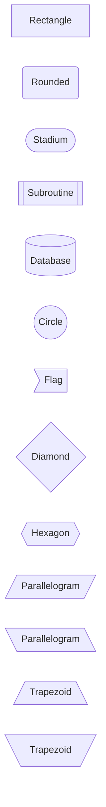
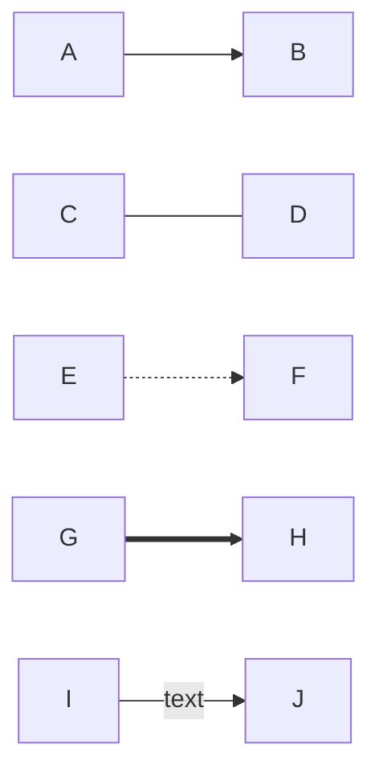
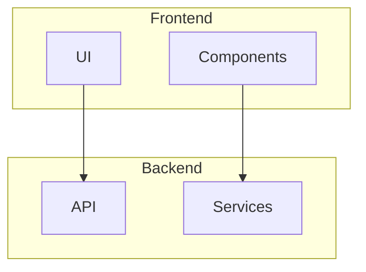
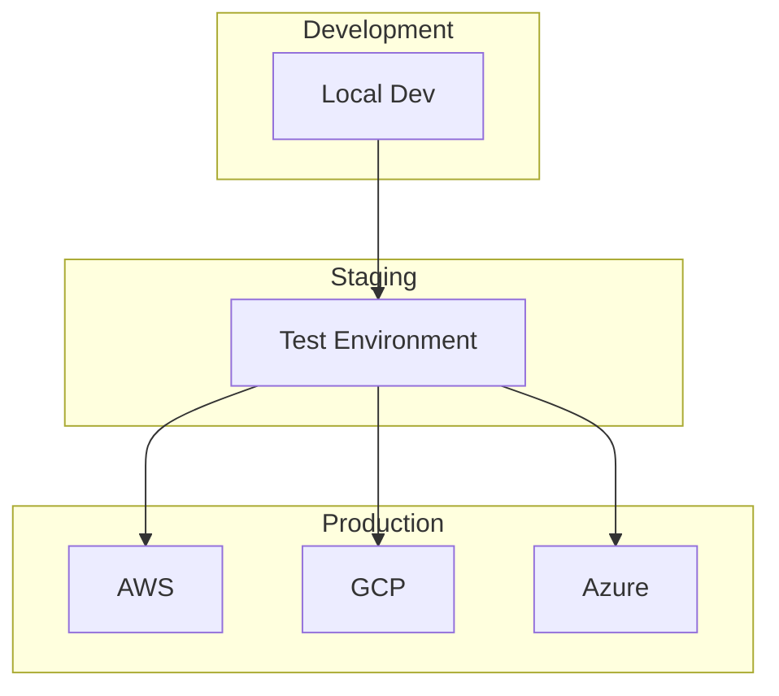

# KB_PROMPT_GRAPHICAL.md

## Purpose
This file contains a reusable prompt template for Claude Code to create comprehensive graphical documentation for any software project using Mermaid diagrams.

---

## Prompt Template for Future Projects

```
Create comprehensive graphical documentation for this project using Mermaid diagrams.

Please create two files:

1. **KB_FILE_STRUCTURE.md** - Detailed file structure and architecture documentation
2. **README.md updates** - Add visual diagrams to the existing README.md

### Requirements for KB_FILE_STRUCTURE.md:

Include the following sections with Mermaid diagrams:

#### 1. Project File Structure Diagram
- Hierarchical tree showing all major directories
- Color-coded by function/purpose (guides, backend, frontend, infrastructure, scripts, etc.)
- Include subdirectories for key components
- Show example file structures for repeated patterns (e.g., if multiple modules follow same structure)
- Use emojis for visual clarity

#### 2. Directory Purpose Overview
- Detailed explanations for each major directory
- Purpose and contents
- Key files and their roles
- Any special patterns or conventions

#### 3. Data Flow Architecture Diagram
- Show how data/requests flow through the system
- Include all major components (frontend, backend, databases, external services)
- Show integration points
- Color-code by layer (user, frontend, backend, services, data)
- Use emojis for component identification

#### 4. Technology Stack
Organize by category:
- Programming languages and runtimes
- Frameworks and libraries
- Infrastructure and cloud services
- Databases and storage
- External APIs and services
- Development tools
- Monitoring and observability

#### 5. Key Configuration Files
List all important configuration files users need to set up:
- Environment variables
- Configuration files
- Build files
- Deployment files

#### 6. Standard Patterns/Structures
Document any repeated directory or file structures in the project.

### Requirements for README.md Updates:

Add the following sections to README.md (or update existing sections):

#### 1. Project Structure Visualization
- High-level Mermaid diagram showing main directories
- Brief description of each top-level directory
- Link to KB_FILE_STRUCTURE.md for detailed breakdown

#### 2. Architecture/Data Flow Diagram
- Visual representation of how components interact
- User journey through the system
- Key integration points

#### 3. Component Breakdown (if applicable)
- Diagram showing major components/modules
- Brief description of each component's purpose

### Mermaid Diagram Best Practices:

1. **Use appropriate diagram types:**
   - `graph TB` or `graph LR` for hierarchical structures
   - `graph LR` for data flows
   - `flowchart` for processes
   - `sequenceDiagram` for interactions over time
   - `erDiagram` for database schemas

2. **Color coding:**
   - Define `classDef` styles for different component types
   - Use consistent color schemes (e.g., blue for frontend, orange for backend, green for infrastructure)
   - Apply classes to nodes for visual grouping

3. **Clarity:**
   - Use line breaks (`<br/>`) in node labels for readability
   - Add emojis to nodes for quick visual identification
   - Group related components together
   - Keep diagrams focused (multiple simple diagrams > one complex diagram)

4. **Styling example:**
```mermaid
classDef frontendStyle fill:#2196f3,stroke:#1565c0,color:#fff
classDef backendStyle fill:#ff9800,stroke:#e65100,color:#fff
classDef dataStyle fill:#4caf50,stroke:#2e7d32,color:#fff

class FRONTEND,UI,PAGES frontendStyle
class API,SERVICES,LOGIC backendStyle
class DB,CACHE,STORAGE dataStyle
```

### Additional Context to Include:

- Development setup instructions
- Deployment process overview
- Testing strategy (if applicable)
- Common commands/scripts
- Links to detailed guides or documentation

### Output Format:

1. Create KB_FILE_STRUCTURE.md with complete documentation
2. Update README.md to include visual diagrams
3. Ensure all Mermaid diagrams render correctly
4. Use markdown formatting for readability
5. Include a "Last Updated" date at the bottom of KB_FILE_STRUCTURE.md
```

---

## Usage Instructions

### For Claude Code:
When asked to create graphical documentation for a new project:
1. Read this prompt template
2. Analyze the project structure
3. Identify all major components and their relationships
4. Create appropriate Mermaid diagrams
5. Follow the requirements and best practices outlined above
6. Adapt the template to the specific project type

### For Users:
To use this template in a new project:
1. Copy this file to your new project root
2. Ask Claude Code: "Using KB_PROMPT_GRAPHICAL.md as a guide, create comprehensive graphical documentation for this project"
3. Claude Code will analyze your project and create customized diagrams

---

## Example Project Types and Adaptations

### Web Application (Full Stack)
- Frontend structure (components, pages, routing)
- Backend API structure (routes, controllers, services)
- Database schema
- Authentication flow
- Deployment pipeline

### Microservices Architecture
- Service topology
- Inter-service communication
- API Gateway routing
- Message queue flows
- Shared libraries/utilities

### Data Pipeline/ETL
- Data flow diagrams
- Processing stages
- Storage layers
- Scheduling/orchestration
- Error handling

### Infrastructure/DevOps
- Resource topology
- Deployment stages
- CI/CD pipeline
- Monitoring and logging
- Security layers

### CLI Tool/Library
- Command structure
- Module organization
- Plugin architecture
- Configuration hierarchy
- Extension points

### Mobile Application
- Screen navigation flow
- Component hierarchy
- State management
- API integration
- Platform-specific code

### Machine Learning/AI Project
- Data pipeline
- Model training flow
- Inference architecture
- Experiment tracking
- Model deployment

---

## Customization Tips

1. **Adjust diagram complexity based on project size:**
   - Small projects: 1-2 diagrams in README, brief KB_FILE_STRUCTURE
   - Medium projects: Multiple diagrams, detailed documentation
   - Large projects: Hierarchical diagrams with drill-down sections

2. **Focus on what's unique to your project:**
   - Standard web app? Focus on custom architecture decisions
   - Novel approach? Emphasize the unique patterns
   - Complex deployment? Detail the infrastructure

3. **Consider your audience:**
   - Internal team: More technical detail, deployment specifics
   - Open source: Contributor onboarding, architecture overview
   - Client documentation: High-level flows, integration points

4. **Keep it maintainable:**
   - Update diagrams when architecture changes
   - Use version control for documentation
   - Include diagram source (Mermaid) for easy editing
   - Add comments in complex diagrams

---

## Mermaid Diagram Reference

### Common Node Shapes


### Arrow Types


### Subgraphs for Grouping


---

## Quality Checklist

Before finalizing documentation, ensure:

- [ ] All major directories are represented
- [ ] Data/request flows are clear and accurate
- [ ] Color coding is consistent and meaningful
- [ ] Diagrams render correctly in preview
- [ ] Technology stack is complete
- [ ] Configuration files are documented
- [ ] Links between documents work
- [ ] README has high-level overview
- [ ] KB_FILE_STRUCTURE has detailed breakdown
- [ ] Emojis enhance rather than clutter
- [ ] Diagrams are not too complex (split if needed)
- [ ] Last updated date is current

---

## Advanced Features

### Interactive Elements
- Use links in Mermaid nodes (supported in some renderers)
- Create collapsible sections in markdown
- Link to external documentation
- Embed code examples

### Multi-Platform Considerations


### Version History
Consider adding a section showing how architecture evolved:
```markdown
## Architecture Evolution

### v1.0 (Initial)
[Simple diagram]

### v2.0 (Current)
[Complex diagram with new features]

### v3.0 (Planned)
[Future architecture]
```

---

## Integration with Other Documentation

This graphical documentation should complement:
- API documentation (OpenAPI/Swagger)
- Code documentation (JSDoc, docstrings)
- User guides
- Deployment runbooks
- Architecture decision records (ADRs)

Cross-reference between these documents for comprehensive coverage.

---

*Last Updated: January 2025*
*Template Version: 1.0*
