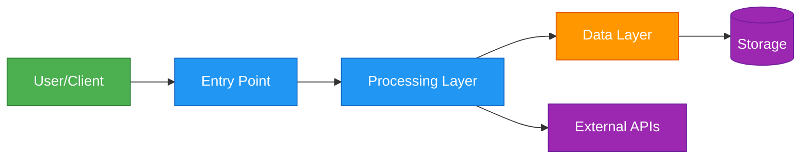

# [PROJECT_NAME] - File Structure

This document provides a comprehensive overview of the project structure, including directories, files, architecture diagrams, and technology stack.

## Project File Structure

```mermaid
graph TB
    ROOT[[PROJECT_NAME]/]

    %% Top Level Directories
    ROOT --> DIR1[directory1/<br/>Purpose]
    ROOT --> DIR2[directory2/<br/>Purpose]
    ROOT --> DIR3[directory3/<br/>Purpose]
    ROOT --> DOCS[📄 Documentation]

    %% Documentation Files
    DOCS --> CLAUDE[CLAUDE.md<br/>AI Assistant Guide]
    DOCS --> CLAUDE_REQS[CLAUDE_CODE_SYSTEM_REQUIREMENTS.md<br/>System Requirements]
    DOCS --> README[README.md<br/>Project Overview]
    DOCS --> KB_STRUCTURE[KB_FILE_STRUCTURE.md<br/>This File]

    %% Example Directory Structure (customize as needed)
    DIR1 --> D1_SUB1[subdirectory/<br/>Contents]
    DIR1 --> D1_SUB2[subdirectory/<br/>Contents]

    DIR2 --> D2_FILE1[important-file.ext]
    DIR2 --> D2_FILE2[another-file.ext]

    %% Styling (customize colors for different component types)
    classDef docsStyle fill:#fce4ec,stroke:#c2185b,stroke-width:2px
    classDef dir1Style fill:#e1f5ff,stroke:#0288d1,stroke-width:2px
    classDef dir2Style fill:#fff3e0,stroke:#f57c00,stroke-width:2px
    classDef dir3Style fill:#f3e5f5,stroke:#7b1fa2,stroke-width:2px

    class DOCS,CLAUDE,CLAUDE_REQS,README,KB_STRUCTURE docsStyle
    class DIR1,D1_SUB1,D1_SUB2 dir1Style
    class DIR2,D2_FILE1,D2_FILE2 dir2Style
    class DIR3 dir3Style
```

## Directory Purpose Overview

### 📁 [Directory Name 1]
[Detailed description of this directory's purpose and contents]

**Key subdirectories:**
- **subdirectory-name/**: [Purpose and contents]
- **subdirectory-name/**: [Purpose and contents]

**Important files:**
- `file-name.ext`: [Purpose]
- `file-name.ext`: [Purpose]

### 📁 [Directory Name 2]
[Detailed description of this directory's purpose and contents]

**Key subdirectories:**
- **subdirectory-name/**: [Purpose and contents]
- **subdirectory-name/**: [Purpose and contents]

**Important files:**
- `file-name.ext`: [Purpose]
- `file-name.ext`: [Purpose]

### 📁 [Directory Name 3]
[Detailed description of this directory's purpose and contents]

**Key subdirectories:**
- **subdirectory-name/**: [Purpose and contents]
- **subdirectory-name/**: [Purpose and contents]

**Important files:**
- `file-name.ext`: [Purpose]
- `file-name.ext`: [Purpose]

---

## Key Files to Configure

### Environment Variables
```
📄 .env (root)                    # [Description]
📄 .env.example                   # Example environment variables
📄 [other env files]              # [Purpose]
```

### Configuration Files
```
📄 [config-file]                  # [Primary configuration]
📄 [config-file]                  # [Secondary configuration]
📄 [config-file]                  # [Build/tool configuration]
```

### Package Management
```
📄 package.json                   # npm/yarn dependencies
📄 requirements.txt               # Python pip dependencies
📄 Cargo.toml                     # Rust dependencies
📄 go.mod                         # Go dependencies
📄 [other package files]          # [Purpose]
```

### Documentation Files
```
📄 CLAUDE.md                      # AI assistant instructions (with imports)
📄 CLAUDE_CODE_SYSTEM_REQUIREMENTS.md  # System requirements (auto-loaded)
📄 KB_FILE_STRUCTURE.md           # This file - project structure (auto-loaded)
📄 README.md                      # Project overview
📄 CONTRIBUTING.md                # Contribution guidelines
📄 LICENSE                        # License information
```

---

## Standard File Structure Patterns

### [Pattern Name 1] (if applicable)

Example: If you have a repeated structure (like modules, components, services), document it here:

```
[pattern-directory]/
├── [file-name].[ext]            # [Purpose]
├── [file-name].[ext]            # [Purpose]
├── [file-name].[ext]            # [Purpose]
└── [subdirectory]/              # [Purpose]
    ├── [file-name].[ext]        # [Purpose]
    └── [file-name].[ext]        # [Purpose]
```

### [Pattern Name 2] (if applicable)

```
[pattern-directory]/
├── [structure]
└── [structure]
```

---

## Data Flow Architecture



### Flow Description

1. **[Step 1]:** [Description of what happens]
2. **[Step 2]:** [Description of what happens]
3. **[Step 3]:** [Description of what happens]
4. **[Step 4]:** [Description of what happens]

---

## Technology Stack

### [Category 1] (e.g., Backend, Frontend, Infrastructure)

- **[Technology 1]**: [Purpose and version]
- **[Technology 2]**: [Purpose and version]
- **[Technology 3]**: [Purpose and version]

### [Category 2]

- **[Technology 1]**: [Purpose and version]
- **[Technology 2]**: [Purpose and version]
- **[Technology 3]**: [Purpose and version]

### [Category 3]

- **[Technology 1]**: [Purpose and version]
- **[Technology 2]**: [Purpose and version]
- **[Technology 3]**: [Purpose and version]

### Development Tools

- **[Tool 1]**: [Purpose]
- **[Tool 2]**: [Purpose]
- **[Tool 3]**: [Purpose]

---

## Testing Infrastructure

### Test Organization

```
[test-directory]/
├── unit/                        # Unit tests
├── integration/                 # Integration tests
├── e2e/                         # End-to-end tests
├── fixtures/                    # Test data and fixtures
└── mocks/                       # Mock objects and stubs
```

### Test Files

**Unit Tests:**
- Location: `[path]`
- Naming: `[pattern]`
- Command: `[test command]`

**Integration Tests:**
- Location: `[path]`
- Naming: `[pattern]`
- Command: `[test command]`

**E2E Tests:**
- Location: `[path]`
- Naming: `[pattern]`
- Command: `[test command]`

---

## Build & Deployment

### Build Process

```
[source] → [build step 1] → [build step 2] → [output]
```

**Build artifacts:**
- `[artifact-name]`: [Description and location]
- `[artifact-name]`: [Description and location]

### Deployment Structure

```
[environment]/
├── [component-1]/
├── [component-2]/
└── [configuration]/
```

---

## Claude Code Import Mechanism

This project uses Claude Code's **import functionality** to automatically load documentation files into every session.

**How It Works:**
1. The file `/[PROJECT_NAME]/CLAUDE.md` contains import directives at the top:
   ```markdown
   @./CLAUDE_CODE_SYSTEM_REQUIREMENTS.md
   @./KB_FILE_STRUCTURE.md
   ```
2. When Claude Code starts a session in this project, it:
   - Reads CLAUDE.md
   - Recursively loads all imported files
   - Incorporates all content into the system context
3. Verify loaded files with the `/memory` command in Claude Code

**Auto-Loaded Files:**
- ✅ CLAUDE.md (main project instructions)
- ✅ CLAUDE_CODE_SYSTEM_REQUIREMENTS.md (technical requirements)
- ✅ KB_FILE_STRUCTURE.md (this file - project structure)

**Benefits:**
- **Always Current:** Claude Code automatically knows project structure and requirements
- **Separation of Concerns:** Requirements, structure, and context in separate files
- **Easy Maintenance:** Update files independently
- **Project-Specific:** Imports only affect this project, not others
- **Consistent Behavior:** Claude follows project standards automatically

**Import Rules:**
- Syntax: `@./relative/path/to/file.md`
- Max depth: 5 hops (recursive imports supported)
- Applies only to the project's CLAUDE.md
- Each project configures its own imports independently

---

## Getting Started

### For Developers

1. **Clone the repository**
   ```bash
   git clone [repository-url]
   cd [project-name]
   ```

2. **Install dependencies**
   ```bash
   [install command]
   ```

3. **Set up environment**
   ```bash
   cp .env.example .env
   # Edit .env with your configuration
   ```

4. **Run development server**
   ```bash
   [dev command]
   ```

5. **Run tests**
   ```bash
   [test command]
   ```

### For Claude Code Users

When working with Claude Code on this project:
1. Run `/memory` to verify all documentation is loaded
2. Check CLAUDE_CODE_SYSTEM_REQUIREMENTS.md for technical standards
3. This file (KB_FILE_STRUCTURE.md) provides the project structure context
4. CLAUDE.md contains project-specific instructions and context

---

## Additional Resources

### Documentation Links
- [Link to external docs]
- [Link to API documentation]
- [Link to architecture diagrams]

### Related Projects
- [Related project 1]: [Description]
- [Related project 2]: [Description]

---

*Last Updated: [Date]*
*Project: [PROJECT_NAME]*
*Version: [Version]*
