# Alex - the Agentic Learning Equities Explainer

## Multi-agent Enterprise-Grade SaaS Financial Planner on AWS

_If you're looking at this in Cursor, please right click on the filename in the Explorer on the left, and select "Open preview", to view it in formatted glory._

### Welcome to The Capstone Project for Week 3 and Week 4!

#### The directories:

1. **guides** - this is where you will live - step by step guides to deploy to production
2. **backend** - the agent code, organized into subdirectories, each a uv project (as is the backend parent directory)
3. **frontend** - a NextJS React frontend integrated with Clerk
4. **terraform** - separate terraform subdirectories with state for each part
5. **scripts** - the final deployment script

#### Project Structure Visualization

For a detailed file structure diagram with complete architecture overview, see [KB_FILE_STRUCTURE.md](KB_FILE_STRUCTURE.md).

```mermaid
graph TB
    ROOT[alex/]

    %% Top Level Directories
    ROOT --> GUIDES[guides/<br/>📚 8 Step-by-Step Guides]
    ROOT --> BACKEND[backend/<br/>🤖 AI Agents + Lambda]
    ROOT --> FRONTEND[frontend/<br/>🎨 NextJS + Clerk]
    ROOT --> TERRAFORM[terraform/<br/>🏗️ Infrastructure]
    ROOT --> SCRIPTS[scripts/<br/>🛠️ Deployment Tools]

    %% Guides Directory
    GUIDES --> G_WEEK3[Week 3: Research]
    GUIDES --> G_WEEK4[Week 4: Platform]
    G_WEEK3 --> G1[1_permissions.md]
    G_WEEK3 --> G2[2_sagemaker.md]
    G_WEEK3 --> G3[3_ingest.md]
    G_WEEK3 --> G4[4_researcher.md]
    G_WEEK4 --> G5[5_database.md]
    G_WEEK4 --> G6[6_agents.md]
    G_WEEK4 --> G7[7_frontend.md]
    G_WEEK4 --> G8[8_enterprise.md]

    %% Backend Directory
    BACKEND --> B_AGENTS[5 AI Agents]
    BACKEND --> B_INFRA[Infrastructure]
    B_AGENTS --> PLANNER[Planner<br/>Orchestrator]
    B_AGENTS --> TAGGER[Tagger<br/>Classifier]
    B_AGENTS --> REPORTER[Reporter<br/>Analysis]
    B_AGENTS --> CHARTER[Charter<br/>Visualization]
    B_AGENTS --> RETIREMENT[Retirement<br/>Projections]
    B_INFRA --> RESEARCHER[Researcher<br/>App Runner]
    B_INFRA --> INGEST[Ingest<br/>Lambda]
    B_INFRA --> DATABASE[Database<br/>Library]
    B_INFRA --> API[API<br/>FastAPI]

    %% Frontend Directory
    FRONTEND --> F_PAGES[pages/]
    FRONTEND --> F_COMPONENTS[components/]
    FRONTEND --> F_LIB[lib/]

    %% Terraform Directory
    TERRAFORM --> TF_INFRA[Independent Modules]
    TF_INFRA --> TF2[2_sagemaker]
    TF_INFRA --> TF3[3_ingestion]
    TF_INFRA --> TF4[4_researcher]
    TF_INFRA --> TF5[5_database]
    TF_INFRA --> TF6[6_agents]
    TF_INFRA --> TF7[7_frontend]
    TF_INFRA --> TF8[8_enterprise]

    %% Scripts Directory
    SCRIPTS --> S_DEPLOY[deploy.py]
    SCRIPTS --> S_LOCAL[run_local.py]
    SCRIPTS --> S_DESTROY[destroy.py]

    %% Styling
    classDef guidesStyle fill:#e1f5ff,stroke:#0288d1,stroke-width:2px
    classDef backendStyle fill:#fff3e0,stroke:#f57c00,stroke-width:2px
    classDef frontendStyle fill:#f3e5f5,stroke:#7b1fa2,stroke-width:2px
    classDef terraformStyle fill:#e8f5e9,stroke:#388e3c,stroke-width:2px
    classDef scriptsStyle fill:#fff9c4,stroke:#f9a825,stroke-width:2px

    class GUIDES,G_WEEK3,G_WEEK4,G1,G2,G3,G4,G5,G6,G7,G8 guidesStyle
    class BACKEND,B_AGENTS,B_INFRA,PLANNER,TAGGER,REPORTER,CHARTER,RETIREMENT,RESEARCHER,INGEST,DATABASE,API backendStyle
    class FRONTEND,F_PAGES,F_COMPONENTS,F_LIB frontendStyle
    class TERRAFORM,TF_INFRA,TF2,TF3,TF4,TF5,TF6,TF7,TF8 terraformStyle
    class SCRIPTS,S_DEPLOY,S_LOCAL,S_DESTROY scriptsStyle
```

#### Data Flow Architecture

```mermaid
graph LR
    USER[👤 User] --> FRONTEND[NextJS<br/>Frontend]
    FRONTEND --> CLERK[🔐 Clerk<br/>Auth]
    FRONTEND --> API[FastAPI<br/>Backend]
    API --> SQS[📬 SQS<br/>Queue]

    SQS --> PLANNER[🎯 Planner<br/>Orchestrator]
    PLANNER --> TAGGER[🏷️ Tagger]
    PLANNER --> REPORTER[📊 Reporter]
    PLANNER --> CHARTER[📈 Charter]
    PLANNER --> RETIREMENT[💰 Retirement]

    REPORTER --> RESEARCHER[🔍 Researcher<br/>App Runner]
    REPORTER --> S3V[📦 S3 Vectors]

    TAGGER --> DB[(🗄️ Aurora<br/>Database)]
    REPORTER --> DB
    CHARTER --> DB
    RETIREMENT --> DB

    S3V --> SAGEMAKER[🤖 SageMaker<br/>Embeddings]
    RESEARCHER --> BEDROCK[☁️ Bedrock<br/>Nova Pro]

    classDef userStyle fill:#4caf50,stroke:#2e7d32,color:#fff
    classDef frontendStyle fill:#2196f3,stroke:#1565c0,color:#fff
    classDef agentStyle fill:#ff9800,stroke:#e65100,color:#fff
    classDef awsStyle fill:#9c27b0,stroke:#6a1b9a,color:#fff

    class USER userStyle
    class FRONTEND,CLERK,API frontendStyle
    class PLANNER,TAGGER,REPORTER,CHARTER,RETIREMENT,RESEARCHER agentStyle
    class SQS,DB,S3V,SAGEMAKER,BEDROCK awsStyle
```

#### Order of play:

##### Week 3

- On Week 3 Day 3, we will do 1_permissions and 2_sagemaker
- On Week 3 Day 4, we will do 3_ingest
- On Week 3 Day 5, we will do 4_researcher

##### Week 4

- On Week 4 Day 1, we will do 5_database
- On Week 4 Day 2, we will do 6_agents
- On Week 4 Day 3, we will do 7_frontend
- On Week 4 Day 4, we will do 8_enterprise

#### Keep in mind

- Please submit your community_contributions, including links to your repos, in the production repo community_contributions folder
- Regularly do a git pull to get the latest code
- Reach out in Udemy or email (ed@edwarddonner.com) if I can help! This is a gigantic project and I am here to help you deliver it!